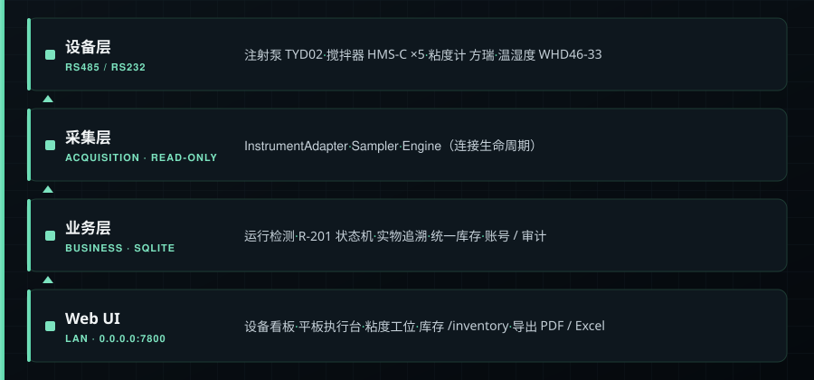

<div align="center">
  
</div>

<br>

<div align="center">

**实验室实验执行 · 设备采集 · 物品库存 三合一平台** —— 统一接入注射泵、粘度计、搅拌器等串口 / Modbus 仪器，
并在同一账号、数据库和扫码入口下管理实验过程、原材料、耗材与办公用品。

一套 **SCADA（实时采集 / 监控）+ LIMS（实验 / 库存管理）** 的混合系统，**只读优先**——
只读取设备数据，不向设备下发控制指令。

</div>

<div align="center">

[](https://www.python.org/)
[](https://flask.palletsprojects.com/)
[](https://www.sqlite.org/)
[]()
[](./LICENSE)
[]()
[](https://github.com/springroll89/lab-device-manager/stargazers)
[](https://github.com/springroll89/lab-device-manager/commits)

</div>

> ⚠️ 本项目默认监听**实验室局域网**（`0.0.0.0:7800`），供平板和 PC 浏览器访问；请通过防火墙限制在受控内网，**勿直接暴露到公网**。

---

## ✨ 核心特性

<table>
<tr>
<td width="33%" valign="top" align="left">

### 📡 多协议设备接入

Modbus RTU（注射泵、搅拌器、温湿度）+ 自定义二进制串口（粘度计），统一适配器接口。

</td>
<td width="33%" valign="top" align="left">

### 📊 实时状态面板

Web 仪表盘实时展示各设备状态、流速 / 转速、累计液量、温度与告警。

</td>
<td width="33%" valign="top" align="left">

### 🧪 R-201 批次执行台

以 Batch ID 串联湿化学合成步骤、语义打标、设备数据截取与记录锁定。

</td>
</tr>
<tr>
<td width="33%" valign="top" align="left">

### 🏷️ 实物全程追溯

为原材料容器、批次、中间品、成品和库位生成离线文本二维码，记录领用 / 暂存 / 取回 / 打印。

</td>
<td width="33%" valign="top" align="left">

### 📦 统一物品与库存

化学品、耗材、办公用品共享 `PC-xxxx` 编号，扫码建档、交接入库、领用、盘点、隔离、处置与审计流水。

</td>
<td width="33%" valign="top" align="left">

### 🖥️ 并行实验工作台

同一操作员可切换多个进行中批次；搅拌器 / 注射泵按物理阶段排他占用，粘度计按样品短租约排队。

</td>
</tr>
<tr>
<td width="33%" valign="top" align="left">

### 📷 平板摄像头扫码

优先用浏览器本地识码；iPhone 等不支持时走局域网服务端 ZXing 解码，图片不落盘。

</td>
<td width="33%" valign="top" align="left">

### 🔐 三级账号权限

强制登录 + 管理员 / 主管 / 操作员三级，首登改密、CSRF 校验、账号审计全程记录。

</td>
<td width="33%" valign="top" align="left">

### 📤 数据导出

CSV、Excel（runs + samples 多 sheet）、单运行 PDF 报告与 R-201 电子批记录 PDF。

</td>
</tr>
</table>

**还有：**

- 📝 **运行记录自动识别** — 自动捕获一次完整运行（start → stop），事后可补录操作员 / 项目标签 / 备注。
- 📋 **运行详情页** — 采样曲线、事件时间线、设置参数与实际液量。
- 🔄 **断网幂等重试** — 平板写操作按账号进入本地 outbox，网络恢复后用同一 `client_event_id` 自动重放。
- ☣️ **危化品与危废管理** — 官方目录 CAS 辅助匹配、SDS 核验、禁忌混存拦截、双人确认、危废容器与国家电子联单登记。
- 🧩 **可扩展** — 新设备只需实现 `instruments/base.py` 的适配器接口即可接入。

---

## 🏗️ 架构

<div align="center">
  
</div>

---

## 🔌 支持的设备

| 设备类型 | 型号 | 协议 | 状态 |
|:---|:---|:---|:---|
| 🧪 注射泵 | Leadfluid TYD02 | Modbus RTU | ✅ 已验证 |
| 🌀 搅拌器 | HMS-C × 5 | Modbus RTU | ⚙️ 串口参数待实测 |
| 💧 粘度计 | 方瑞 | 自定义二进制串口 | ⚙️ 校验和 / 帧类型待实测（标记仅供参考） |
| 🌡️ 温湿度 | WHD46-33 | Modbus RTU | ✅ 三通道采集；工艺判定须绑定明确通道 |

> 新设备可通过实现 `instruments/base.py` 中的适配器接口扩展。

---

## 🚀 快速开始

### 1 · 安装依赖

```bash
python3 -m venv .venv
source .venv/bin/activate
pip install -r requirements.txt
```

### 2 · 配置设备

```bash
cp config.toml config.local.toml     # 复制默认配置，编辑实际端口与参数
```

<details>
<summary><b>关键配置项示例</b>（点击展开）</summary>

```toml
db_path            = "./data/lab_device_manager.db"
sample_interval_ms = 1000
web_host           = "0.0.0.0"            # 监听局域网，供平板访问
web_port           = 7800
public_base_url    = "https://lab-device.example.lan:7800"   # 平板访问地址
tls_certfile       = "/path/to/lab-device.crt"               # 受平板信任的证书
tls_keyfile        = "/path/to/lab-device.key"
auto_open_browser  = true

[[devices]]
name        = "pump-1"
type        = "tyd02"
alias       = "注射泵"
serial_port = "/dev/cu.usbserial-XXXXXX"  # macOS/Linux 实际端口
baudrate    = 9600
parity      = "EVEN"        # 8E1
modbus_addr = 1
wordorder   = "CDAB"
```

> `secret_key` 首次运行时会自动生成并保存到 `data/.session_secret`，无需手动填写。

</details>

### 3 · 启动应用

```bash
source .venv/bin/activate
python -m lab_device_manager
```

启动后服务器电脑会自动打开本机页面。平板连接同一局域网后，使用 `public_base_url` 配置的地址访问；不使用摄像头的临时测试也可以打开 `http://服务器局域网IP:7800`。

<details>
<summary><b>🍎 macOS 双击启动</b>（点击展开）</summary>

- 在项目根目录双击 `启动Puricore实验系统.command`，系统会检查服务状态、启动 PC 与平板共用的同一套后台，并复制局域网地址。
- 服务运行期间可以最小化启动窗口；需要关闭时双击 `停止Puricore实验系统.command`，只会停止由快捷方式记录的本项目进程。
- 运行日志保存在不纳入版本控制的 `data/puricore-shortcut.log`。

</details>

<details>
<summary><b>🔑 首次登录、默认账号与主要入口</b>（点击展开）</summary>

- 全新数据库首次登录使用账号 `admin` / 密码 `admin`，随后必须立即设置至少 8 位且同时包含字母和数字的新密码。
- 默认账号只在账号表为空时创建，重启**不会**把已修改的密码恢复为 `admin`。
- 需要在首次初始化前改变临时管理员密码，可设置环境变量 `LAB_INITIAL_ADMIN_PASSWORD`。
- 主要入口：
  - R-201 批次执行台：`/experiments`
  - 物品与库存：`/inventory`（旧 `/materials` 地址仍可使用）
  - 危废管理：`/hazardous-waste`
  - 共享粘度计工位：`/measurement-station`

</details>

> 📌 R-201 第一版固定运行在 `parallel_validation`（纸电并行验证）模式。账号制提供唯一操作身份和审计，但**当前不等于**法规意义上的电子签名，正式放行仍以受控纸质签名为准。
>
> 📌 第一版按「一台设备一个串口」运行；HMS-C 五台共享同一 RS485 总线的多从机调度尚未启用。

---

## 📁 项目结构

```
lab_device_manager/
├── __main__.py          # 应用入口：加载配置、启动 Engine 与 Flask
├── config.py            # 配置加载与 session secret 管理
├── sampler.py           # 主采样循环
├── db/                  # SQLite 仓库、R-201 数据模型与迁移
├── experiments/         # R-201 状态机、自动派生、偏差和追溯服务
├── inventory/           # 库存、法规目录、危化品与危废管理
├── instruments/         # 设备适配器；WHD46 已拆为独立子包
├── modbus_io.py         # Modbus RTU 帧 / 客户端工具
├── runtime/             # Engine、运行检测器、设备配置类型
└── web/                 # Flask API、平板执行台、设备看板和标签模板

scripts/                 # 探针与调试脚本
tests/                   # pytest 测试集
温湿度监控器/            # WHD46 模块说明与维护入口
config.toml              # 默认配置文件
requirements.txt         # 运行时依赖
requirements-dev.txt     # 开发依赖
```

---

## 🧪 R-201 数字化实验 · 实物追溯 · 物品库存

把实验执行从「把纸表搬到平板」升级为「**设备持续采集，操作员只负责给真实操作打时间标记**」，并把实验、设备和物品库存统一在一套账号与数据库里。

- **设备数据驱动** — 四类设备数据由采集引擎持续写入；操作员点击「开始加酸」「到达 40℃」等语义按钮，系统用步骤起止时间截取设备数据，环境温湿度 / 转速 / 温度 / 累计液量差 / 粘度等字段优先自动生成，可从电子批记录反查原始数据。
- **并行实验与排他占用** — 同一操作员可切换多个进行中批次；搅拌器 / 注射泵按物理阶段排他占用，共享粘度计按样品短租约排队，数据库级占用不能被自动绑定绕过。
- **统一库存** — 化学品、耗材、办公用品共享 `PC-xxxx` 编号；R201-03 扫码确认用料后，在同一 SQLite 事务中保存实验步骤、扣减库存并写入流水，重复请求不重复扣库、库存不足整组回滚。
- **危化品合规控制** — 按 CAS 辅助匹配官方目录，保存来源交接、供应商 SDS、GHS、储存组与复核证据；资料不完整、库位不兼容或双人确认未完成时禁止领用。
- **危废闭环** — 独立记录危废容器、危险特性、暂存、封口、承运与处置资质及国家电子联单编号；本系统登记不替代国家危险废物信息系统。
- **离线二维码** — 标签使用 UTF-8 离线文本二维码，不依赖服务器地址，扫描即显示类型 / 名称 / 编号 / 批次 / 状态 / 实验人。

相关文档：[`docs/TRACEABILITY-ROADMAP.md`](docs/TRACEABILITY-ROADMAP.md) ·
[`docs/INVENTORY-INTEGRATION.md`](docs/INVENTORY-INTEGRATION.md) ·
[`docs/危化品管理-国家要求与系统对照.md`](docs/危化品管理-国家要求与系统对照.md) ·
[`docs/LAN-DEPLOYMENT.md`](docs/LAN-DEPLOYMENT.md) ·
[`docs/REPORT-R201-V1.md`](docs/REPORT-R201-V1.md) ·
[`docs/UAT-R201-01.md`](docs/UAT-R201-01.md) ·
[`docs/UAT-R201-02.md`](docs/UAT-R201-02.md)。

---

## 🛠️ 开发

### 运行测试

```bash
source .venv/bin/activate
python -m pytest -v
```

当前测试覆盖：设备解码、Modbus 帧、Repository、运行时引擎、Web API、认证流程、R-201 状态机、幂等事件、温度检查点、粘度终点、偏差闭环、四设备固定 fixture，以及库存事务、权限、法规目录、禁忌混存、双人确认、危废台账、导出、旧库迁移和实验用料联动。

### 添加新设备

1. 在 `lab_device_manager/instruments/` 下实现 `BaseInstrumentAdapter` 子类。
2. 在 `lab_device_manager/instruments/factory.py` 注册设备类型。
3. 在 `config.toml` 中配置 `type` 与串口参数。
4. 添加对应单元测试。

---

## 🔒 安全说明

- 应用默认监听 `0.0.0.0:7800`，**必须用防火墙限制为受控实验室局域网**。
- 软件记录不能替代实体双锁、防火防爆、人员培训、公安系统报送或国家危险废物电子联单；正式使用前须由合作双方 EHS / 负责人确认职责与现场条件。
- 生产 / 共享环境请：
  - 首次登录后立即修改默认管理员密码；
  - 为每位人员创建独立账号，不共享管理员账号；
  - 定期停用离职或不再参与实验的账号；
  - 使用受平板信任的证书启用 HTTPS，以保证网页摄像头可用；
  - 定期轮换 `data/.session_secret`。

---

## 📜 变更日志

<details>
<summary><b>📂 点击展开历史更新记录</b></summary>

### 2026-08-03 · 代码评审加固

- 修复测量工位的存储型 XSS，并为实验、追溯、设备绑定、粘度记录和运行补录等写接口补齐 CSRF 防护；默认 `admin/admin` 仅允许在本机完成首次登录改密。
- SQLite 文件数据库启用 WAL，所有共享连接查询统一加锁；实验详情和设备占用查询不再通过 GET 隐式写库。
- 库存合规检查与扣减、物品资料更新与合规复核、粘度计占用与读数记录分别合并为原子事务；删除实验时保护关联库存和危废台账。
- SSE 实时状态补齐遥测完整性字段并保护正在输入的表单；扫码、轮询和提交按钮增加资源释放、防重入与稳定幂等编号。
- 双击启动和停止脚本增加进程身份核验、慢迁移等待与安全退出兜底；项目最低 Python 版本统一为 3.11。

### 2026-08-03 · UT-6804 网络采集与设备状态分层

- 采集引擎新增串口服务器透明 TCP 通道，支持通过 `host + tcp_port` 接入 UT-6804；网络或网关恢复后会在下一次采样时自动重连，无需人工点击上线。
- 当前现场端口已配置为：串口 1 / `4001` 接 LVDV-2T 粘度计，串口 2 / `4002` 接 TYD02 注射泵，串口 3 / `4003` 接 HMS-C 搅拌器。
- 设备看板将「通讯状态」和「运行状态」分开：可区分通讯正常、数据中断、网关离线、仪器无响应和通讯异常，避免把 TCP 端口可连接误判为仪器在线。
- 主看板每秒刷新；有效数据超过 15 秒未更新时自动显示数据中断。接线恢复并重新收到有效仪器数据后，状态自动恢复。
- 当前仍坚持只读采集，不向仪器下发启停、速度或温度控制指令。

### 2026-07-25 · 危化品与危废管理加固

- 内置官方《危险化学品目录（2015 版）》及 2022 年柴油调整数据，共 2828 条，按 CAS 辅助匹配；未匹配不能直接认定为非危化品，仍需人工法规复核。
- 新增储存组、GHS 图示、供应商 SDS 核验、目录来源与复核证据；资料不完整的目录危化品禁止领用和实验直接扣料。
- 库位新增柜体类型、允许储存组、物理防护与双人控制设置；新建、编辑、领用和实验投料时硬性拦截禁忌混存。
- 对剧毒、重大危险源、药品类易制毒及单位明确加严的物料启用两个不同账号确认，并阻止客户端伪造复核身份。
- 物料由合作高校渠道采购，本系统不增加采购申请、审批或下单流程；从交接验收入库开始记录来源单位、交付凭证、接收人与来源方许可/备案凭证（如适用）。
- 新增 `/hazardous-waste` 危废台账，记录危废容器、暂存、封口、国家电子联单、承运资质、处置单位许可证和完成转移，并支持 CSV 导出。
- 新增迁移 `011_hazardous_inventory_controls.sql`、`012_receipt_and_hazardous_waste.sql`；法规依据、软件边界和上线前线下事项见 [`docs/危化品管理-国家要求与系统对照.md`](docs/危化品管理-国家要求与系统对照.md)。

### 2026-07-25 · 平板与移动执行模式重做

- `/experiments` 继续作为创建和切换批次的实验工作台；进入 `/experiments/<批次ID>` 后自动切换为聚焦式执行模式，共用同一账号、后台、设备流和数据库，不需要安装独立 App。
- 执行模式顶栏只保留批次号、当前步数、总进度、扫码、退出执行和账号入口；设备看板、库存等全局导航不再挤占现场操作空间。
- 当前步骤使用大字号说明和大面积语义打标按钮；相关设备独立显示在线状态、专属指标和浏览器会话内积累的真实实时趋势，设备离线时仍保留折叠式人工补录。
- 时间轴统一展示人工标记、设备自动捕获和异常提示；平板横屏使用左右布局，平板与手机竖屏自动改为「步骤 → 大按钮 → 设备数据 → 时间轴」的单列顺序。

### 2026-07-25 · 物品库存系统融合

- 仓库首次瓶级盘点已按「一个实物瓶一个 `PC-xxxx` 系统码」导入：共 17 种、34 瓶、7 个库位；供应商批号相同的多瓶仍保留同一批号，但使用独立系统码和二维码区分。
- 化学品增加「危化品判定」和「特殊管制类别」两个独立字段，可区分目录危化品、按 CAS 未在目录检出、待 SDS/法规核验，以及易制爆、易制毒第三类、剧毒和内部受控。
- 已开封但未称量的瓶不再误记为 0 或整瓶余量，界面显示「待盘点」，完成实际盘点前禁止直接领用；包装异常的氯化铜瓶按隔离状态登记。
- 原材料二维码和标签增加登记实验人；库存列表可一次生成当前筛选结果的全部瓶贴，库位也支持批量打印。
- 新增 `010_inventory_compliance_fields.sql` 与幂等 JSON 清单导入工具 `scripts/import_inventory_manifest.py`；默认只预演，使用 `--apply` 时先备份 SQLite，库位、物品和初始流水在同一事务内写入。
- 原独立 `puricore-lab-inventory` 的化学品、耗材、办公用品、危险性、SDS、CAS 查询、库存阈值、临期 / 过期、管制品、待处置和审计能力已迁入本系统；不再通过 iframe 或第二套登录运行。
- `/inventory` 是统一入口，`/materials` 保留为兼容地址；设备看板、实验执行、粘度工位和账号菜单均可直接进入。
- 最高管理员与实验室主管可以建档、编辑、入库、盘点、隔离和处置；操作员可以查看、扫码和领用。所有写操作自动记录当前登录账号，并校验 CSRF。
- R201-03 扫码确认用料后，在同一个 SQLite 事务中保存实验步骤、扣减库存和写入 `experiment_used` 流水；重复请求不会重复扣库，库存不足会整组回滚。
- 库存首页显示低库存、超量、临期、过期、待处置、危险性统计和上次盘点时间；流水支持按操作和日期查询，库存、流水和待处置清单可分别导出 CSV。
- 标签继续使用离线纯文本二维码；供应商条码与系统 `PC-xxxx` 标签均可通过平板摄像头、扫码枪或手工输入查询。
- 新增可选库存日报命令。默认只预览；只有显式使用 `--send` 并通过环境变量配置钉钉机器人时才联网发送。
- 新增 `008_inventory_module.sql` 与 `009_inventory_ledger_backfill.sql`；前者扩展统一库存模型，后者把旧原材料容器事件前向迁入库存流水。
- 提供旧 Supabase 库存 CSV 的幂等迁移工具。默认 dry-run，正式导入前自动备份 SQLite，任一记录错误会整批回滚。详见 [`docs/INVENTORY-INTEGRATION.md`](docs/INVENTORY-INTEGRATION.md)。

### 2026-07-24 · 全量 Code Review 修复

- 批次操作、偏差处置、复核、粘度测量、实验事件和运行补录现在同时保存账号 ID；权限判断以唯一账号 ID 为准，同名账号不能接管他人批次，客户端也不能伪造运行记录中的操作员。
- 返工会使被替代的 R201-50 粘度测量退出终点判定；新一轮老化必须重新取得两次合格且稳定的读数，旧数据仍保留用于审计。
- 温度遥测完整性分析不再只读取最后 1000 条样本，长时间实验早期的数据缺口也会进入完整性状态和偏差判断。
- TYD02 的累计量、目标量和注入速率会按设备上报的 nL/µL/mL/L 单位统一换算为 mL 和 mL/min；单位未知时不猜测，非「仅注入」模式也不会自动填入加酸步骤。
- 平板离线队列按登录账号隔离。网络错误、HTTP 429 和服务器 5xx 会保留原操作等待重试；409 版本冲突会保留并明确提示，由操作员确认放弃旧操作后刷新，不再静默丢失。
- 方瑞粘度计在校验和算法、扭矩缩放和帧类型完成真机确认前标记为「仅供参考」，其读数不能作为 `device_confirmed` 数据或自动满足粘度终点。
- 应用启动时会关闭上次进程遗留的未结束运行，正常关机、设备重连、手动断开和通信中断也会写入对应的结束状态，避免数据库出现永久悬空运行。
- 新增数据库迁移 `006_integrity_identity.sql`；旧记录保留原姓名字段，仅在姓名能唯一对应有效账号时自动回填账号 ID。

### 2026-07-24 · 局域网、并行实验与追溯更新

- Web 服务默认监听 `0.0.0.0`，同一局域网内的平板和 PC 可使用不同账号同时访问同一套设备数据与实验记录。
- 实验页面使用持续 SSE 接收设备状态，并用记录版本同步另一台终端产生的步骤、偏差、粘度和追溯变化。
- 「进行中实验」按账号列出全部活动批次；主管可查看所有批次，扫描实物标签可直接打开所属实验。
- 搅拌器和注射泵新增数据库级排他占用，自动绑定也不能绕过；注射泵在加酸结束后释放，搅拌器在降温结束后释放。
- 新增粘度测量工位。扫描待测样品后短时锁定共享粘度计，读数只进入对应批次，记录后释放。
- 新增原材料管理页：可扫描供应商条码建档、打印内部耐久标签，在 R201-03 扫码带入材料、批号、有效期和余量，并在确认实际用量后扣减库存。
- 原材料首次领用自动记录开封；「查看记录」可从单个容器反查每次用量、操作员和受影响实验批次，批记录也保存原材料容器编号。
- 标签二维码改为 UTF-8 离线文本，扫描后直接显示类型、名称、编号、批次、状态、生成时间和实验人；二维码不再依赖服务器地址，系统扫码仍可从文本中提取编号。
- 平板摄像头识码增加局域网 ZXing 兜底，兼容二维码、Code 128、EAN 等常用格式，上传帧仅在内存中解码。
- 新增迁移 `007_parallel_traceability.sql`；部署步骤见 [`docs/LAN-DEPLOYMENT.md`](docs/LAN-DEPLOYMENT.md)。

### 2026-07-24 · 账号与权限更新

- 系统不再提供「免密码本机身份模式」，所有页面、设备接口和实验 API 都必须先登录。
- 首次初始化自动创建最高管理员：账号 `admin`、密码 `admin`；首次登录强制修改密码，未改密前不能进入设备或实验页面。
- 密码使用安全哈希保存，数据库不保存明文；连续登录失败 5 次会暂时限制该账号。
- 最高管理员可管理主管与操作员；主管只能创建、重置和停用操作员；操作员不能进入账号管理。
- 新建账号和密码重置都会产生临时密码，账号下次登录必须自行设置新密码。
- 账号创建、密码修改 / 重置、启停均写入审计记录；停用账号不会删除历史实验数据。
- 所有登录后页面统一显示当前账号菜单；每一级账号都能直接修改自己的密码。

| 账号级别 | 主要权限 |
| --- | --- |
| 最高管理员 `admin` | 管理主管与操作员、重置或停用下级账号、使用全部业务功能 |
| 实验室主管 | 管理操作员、承担实验复核、使用设备与实验功能 |
| 操作员 | 执行实验、查看设备、修改自己的密码 |

### 2026-07-24 · 数据完整性复核更新

- 平板提交的可信客户端时间仅允许与服务器校正时间相差 ±30 秒；超出范围时保留原始客户端时间和偏移量作为审计证据，但步骤计算改用服务器接收时间。
- 同一次遥测评估产生的数据缺口偏差、到温标记和恒温检查点现在在同一事务内写入；任一写入失败时整组回滚，避免只保存一半派生结果。
- TYD02 注射泵会拒绝非有限值以及超出设备协议范围的温度、转速、进度和注射器参数，异常帧不再进入实验自动计算。
- 批次号建议直接从数据库查询当日同体系的最大数字序号，不再受最近 1000 条实验记录限制；非数字后缀不会干扰自动编号。
- 已按 HMS-C 原始通讯协议复核温度寄存器：该字段规定范围为 0–320，继续使用无符号整数解码，不按负温度字段修改。

### 2026-07-24 · 稳定性与平板交互更新

- 手动补录展开后，实时设备刷新不再收起输入区或抢走焦点；已输入内容继续保存在当前浏览器会话草稿中。
- 顶部已完成步骤支持点击查看，只读展示当时保存的结果、操作员和起止时间；查看历史不会回退流程或覆盖后续数据。
- SQLite 设备采样写入统一串行化；粘度计噪声缓存设定上限，WHD46 短帧会被拒绝，串口初始化失败会立即释放句柄。
- R-201 拒绝 `NaN`、无穷值、布尔伪数值和非法时间戳；偏差编号在事务内生成，步骤启动并发冲突返回 409。
- 待复核批次禁止新增偏差或更换设备；偏差处置统一校验记录版本，提交与发布均在事务内复查未闭环异常。
- 默认优先读取不纳入版本控制的 `config.local.toml`；Excel 导出参数和运行标签接口补齐 400/404 响应。
- WHD46 目录浏览与 CSV 保存仅允许项目目录、桌面、文档、下载和外接卷等明确存储位置。

### 2026-07-24 · 设备模块与批次绑定更新

**WHD46-33 模块化**

- 新增独立驱动包 `lab_device_manager/instruments/whd46/`，拆分设备适配器、寄存器解码和串口发现；原 `whd46_33.py` 保留为兼容入口。
- WHD46 专属实时 / 历史 / 连接 / CSV 接口迁移至 `lab_device_manager/web/whd46.py` Blueprint，主应用不再混放设备特有逻辑。
- 连接生命周期统一归 `runtime/engine.py` 管理；串口探测不长期占用端口，确认设备后由 Engine 执行采样、重连和断开。
- 新增 [`温湿度监控器/README.md`](温湿度监控器/README.md)，集中记录 WHD46 的代码入口、配置与维护边界。

**多台搅拌器与批次设备绑定**

- `config.toml` 中 5 台 HMS-C 配置保持不变，主设备面板继续展示全部已配置搅拌器。
- 修复实验执行页仅用 `.find()` 取第一台搅拌器的问题；同类设备只有一台时自动绑定，有多台且无法唯一判断时操作员只需为当前批次选择一次现场设备。
- 批次选择会同时绑定搅拌转速和反应温度两个数据角色；之后步骤截取、自动填入和电子批记录均只使用选中的设备。
- 现场更换设备时点击「更换」，旧绑定保留结束时间，新绑定与选择事件进入审计时间轴。
- 未完成多设备选择前，系统会阻止开始或完成相关步骤；设备离线时仍保留带来源标记的人工补录入口。

### 2026-07 · R-201 数字化迭代

把实验执行从「把纸表搬到平板」调整为「设备持续采集，操作员只负责给真实操作打时间标记」。

- **设备数据驱动**：四类设备数据由采集引擎持续写入后台；操作员点击语义按钮，系统用步骤起止时间截取设备数据；自动结果保留设备、指标键、原始样本、采样时间、截取窗口与计算方式，可从电子批记录反查原始数据。前后台统一以最近 15 秒内收到设备帧作为「在线可用」。
- **实物追溯与标签**：标签版面由 60×40 mm 加高到 60×48 mm，长编号和二维码下方文字可以自动换行，不再被下沿截断。
- **当前边界**：应用只读取设备数据，不向设备自动下发启停、转速、温度或泵速指令；HMS-C 与粘度计仍需结合真机完成串口参数及字段缩放验证；当前默认一台设备占用一个串口。

</details>

---

## 📄 许可证

[MIT](./LICENSE) © 2026 springroll89
