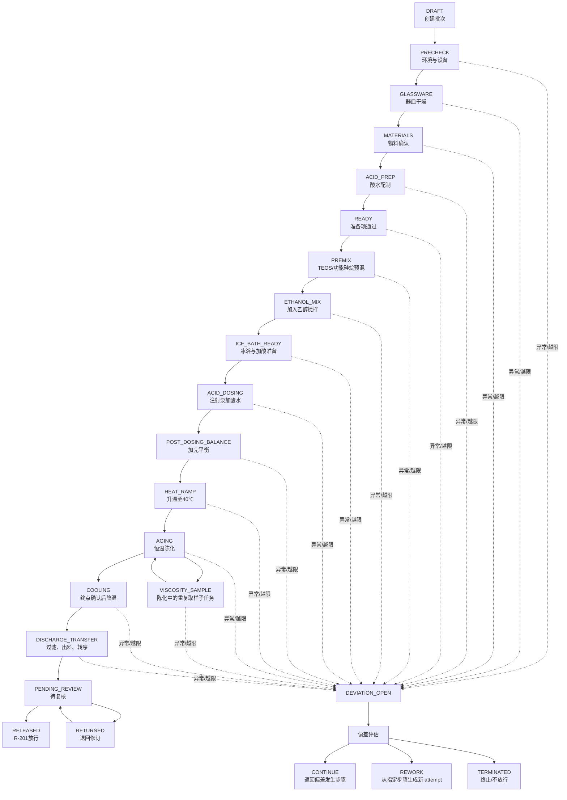
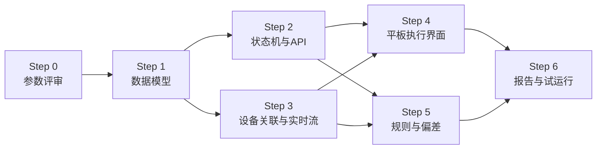

# R-201 湿化学合成数字化流程蓝图

> 状态：Draft，待工艺参数评审
> 日期：2026-07-23
> 适用范围：CEM（TEOS-MPTES）与 AEM（TEOS-TMAPS）溶胶制备阶段 R-201
> 目标版本：R-201 MVP
> 关联项目：Lab Device Manager

## 1. 目的

本蓝图把实验室现行 SOP、质量记录表和标准化实验报告转化为可实现的数字化流程、数据契约和验收标准。

R-201 MVP 的核心不是把纸质表格原样搬到平板，而是建立一条可追溯的实验时间轴：

1. 操作员通过平板确认真实操作，形成带时间戳的人工事件。
2. HMS-C、TYD02、方瑞粘度计和 WHD46-33 持续采集设备数据。
3. 系统把人工事件、设备运行、遥测样本、物料和粘度测量关联到同一个 Batch ID。
4. SOP 规则实时判断缺项、越限和时间逻辑，必要时生成偏差记录。
5. 实验结束后自动形成 R-201 电子批记录，供复核、放行和后续配方分析。

## 2. 来源与适用优先级

### 2.1 来源文件

| 来源 | 在系统中的角色 | 主要内容 |
|---|---|---|
| `SOP-溶胶凝胶法制备CEM-AEM膜-湿化学合成SOP.docx`，V0.2 | 规则来源 | 操作顺序、控制窗口、取样与终点逻辑、异常处理 |
| `CEM-AEM功能膜制备标准化实验报告记录表.pdf`，V0.2 | 批记录模板 | 批次字段、R-201 阶段记录、复核、偏差、放行 |
| `SDL_质量记录表V0.2.xlsx` | 质量指标候选字典 | 工序编号、指标名称、单位、判据、检测方法 |
| 当前仓库设备适配器与数据库 | 技术事实 | 现阶段可自动采集字段、设备运行与样本存储能力 |

这些来源文件目前不纳入仓库，实施时应保存受控副本或文档哈希，并记录对应的批准版本。

### 2.2 参数适用优先级

同一参数出现不同数值时，按以下顺序决定批次实际判据：

1. 已批准且明确关联本 Batch ID 的配方或工艺指令。
2. 当前生效的受控 SOP 版本。
3. 标准化实验报告中的通用控制窗口。
4. 质量记录 Excel 中的候选判据。

每个批次必须保存实际采用的参数快照，不能只引用一份随后可能被修改的模板。Excel 中尚未完成确认的值不得直接编码为阻断规则。

## 3. 范围

### 3.1 R-201 MVP 包含

- Batch ID 创建与 CEM/AEM 体系选择。
- 操作员、复核员、配方号、SOP 版本和目标粘度范围。
- 器皿干燥、设备状态、环境和物料批次确认。
- 盐酸溶液配制记录与计算复核。
- TEOS/功能硅烷预混。
- 加入无水乙醇后的搅拌。
- 冰浴准备、注射泵加酸水和加完后的平衡。
- 升温至 40 ℃、恒温陈化和每 20 分钟温度记录。
- 多次粘度测量、趋势展示与终点判定。
- 降温、过滤、出料、转序和容器标签确认。
- 偏差、修订、复核和 R-201 放行。
- 平板实时步骤引导和后台实时数据联动。

### 3.2 R-201 MVP 不包含

- 从 App 向设备下发启停、转速、温度或泵速指令。
- 涂覆 C-320R、干燥 D-401、剥离 M-002、切割 L-501、氧化 F-801、清洗 W-901 和性能测试的完整执行界面。
- AI 配方推荐或自动修改工艺参数。
- 用普通 Excel 单元格覆盖审计记录。

下游模块沿用本蓝图的数据和审计模式逐步扩展。CEM/AEM 路由差异在 R-201 批次中预先保存，但不会在 R-201 MVP 内执行下游工序。

## 4. 核心设计原则

### 4.1 实验批次与设备运行分层

当前系统中的 `run` 表示由设备状态转换识别出的运行区间；对持续推流或长期监测设备，它未必对应一次独立物理操作。R-201 中一个实验批次会包含多台设备的多个运行/监测区间，因此不能把一个 `run` 等同于一个实验。

- `experiment`：以 Batch ID 为主线的完整 R-201 实验。
- `step_instance`：某个 SOP 步骤在该实验中的一次执行。
- `run`：已有的设备状态检测区间，保持现有语义；不能假定所有设备都有短时、独立的物理运行。
- `experiment_data_source_binding`：用设备、指标/通道和时间窗口把设备数据关联到实验步骤。
- `sample`：已有的设备连续遥测；既支持关联 `run_id`，也允许 `run_id=NULL` 的连续监测样本。
- `experiment_event`：平板点击、自动里程碑、修订和审核等实验事件。

### 4.2 事件先于表单

“开始加酸”首先是一个不可覆盖的事件，其次才是报告中的一行数据。每个关键操作至少记录：

- `occurred_at_client_ms`：平板记录的真实点击时间。
- `received_at_server_ms`：服务端接收时间，作为审计顺序。
- `client_clock_offset_ms` / `clock_sync_status`：客户端时钟相对服务端的偏移和可信状态。
- `effective_at_ms`：在线且时钟可信时采用校正后的客户端时间；不可信时标记为待复核，不能静默改用接收时间冒充操作时间。
- `client_event_id`：客户端生成的唯一键，用于断线重试和防重复。
- 操作员、Batch ID、步骤、事件类型、输入值和关联设备。

设备样本同样区分采样时间和入库时间。网络恢复后的迟到事件保持真实发生顺序，并在报告中显示其同步状态。

### 4.3 设备数据为主，人工只负责语义打标

R-201 的默认数据路径是“设备连续采样 → 平板标记操作起止 → 系统按时间窗口截取并计算”，而不是让操作员抄写设备屏幕。

- 平板主界面只要求操作员确认真实动作，例如“开始加酸”“加酸完成”“到达 40℃”。
- 系统用步骤起止事件切分连续遥测，自动生成温度、转速、累计量差值、持续时间和粘度等批记录字段。
- 每个自动结果必须保存设备、指标键、原始样本、采样时间、截取窗口和计算公式，报告值能够反查原始数据。
- 自动值超出建议范围时应在当前步骤立即提示，由操作员选择返回检查或“数据无误，记录异常”，不能留到实验结束才突然阻断。
- 只有设备离线、数据过期或目标指标缺失时才展开人工补录；人工值必须明确标记来源，不得伪装成设备自动采集。
- 前后台统一以最近 15 秒内收到设备帧作为“在线可用”，超过阈值显示数据中断并启用补录路径。

### 4.4 原始数据不可覆盖

- 设备原始样本只追加，不更新。
- 人工修订采用“原值 + 新值 + 修订原因 + 修订人 + 修订时间”。
- 已完成步骤不能直接重新编辑；需要发起修订或步骤重做。
- 报告展示当前有效值，同时保留完整审计链。

### 4.5 实时规则与最终放行分离

- 实时规则负责提醒、阻断危险或明显不完整的操作。
- 偏差不等于自动判废；偏差须经影响评估后形成最终处置。
- “合格 / 不合格 / 偏差待评估”是统一判定枚举。
- 只有复核员完成时间逻辑、单位、体系路由和偏差检查后才能放行。

## 5. 角色与权限

| 角色 | 主要权限 |
|---|---|
| 操作员 | 创建草稿批次、执行步骤、填写物料和测量、发起偏差、提交复核 |
| 复核员 | 复核计算和步骤、处理偏差、退回修订、批准 R-201 放行 |
| 质量人员 | 审批重大偏差、维护受控 SOP/规则版本、查看审计记录 |
| 管理员 | 维护账号、设备档案、设备通道角色；不得替代实验签名 |
| 只读人员 | 查看批次、曲线、报告和导出数据 |

MVP 可以先实现操作员、复核员和管理员三类角色，但数据模型必须保留质量人员审批位置。

当前系统只有共享 `login_password`，没有可归责的用户身份和角色，因此不能直接宣称已经具备电子签名能力。正式放行前必须先实现：

- 唯一用户身份、角色和禁用状态。
- 密码的安全存储与会话绑定。
- 签名时重新认证，而不是复用一个共享登录状态。
- 操作员和复核员不能是同一身份的规则。
- 登录、签名失败、角色变化和管理员操作审计。

在这些能力完成前，系统只能运行在 `parallel_validation` 模式：电子确认用于纸电并行验证，纸质签名仍是正式放行依据。

## 6. R-201 状态机



`DEVIATION_OPEN` 是叠加状态，不替代当前工艺步骤。R201-51 粘度测量是 R201-50 陈化期间可重复执行的子任务；执行取样时主状态仍为 `AGING`，温度、搅拌和冷凝回流规则持续生效。通讯丢失、暂停设备等状态也作为事件记录，不应让批次脱离当前步骤。返工通过新的 `attempt_no` 回到评估指定步骤，原步骤标记为 `superseded`；终止进入 `TERMINATED`，不得继续正常放行。

## 7. 步骤定义与转换条件

| 步骤代码 | 平板主提示 | 必填/自动记录 | 完成条件 | 主要异常 |
|---|---|---|---|---|
| R201-00 | 创建实验批次 | Batch ID、体系、配方号、SOP 版本、目标粘度、操作员、复核员 | Batch ID 唯一且参数快照完成 | 版本缺失、批号重复 |
| R201-01 | 确认环境与设备 | 环境温湿度、设备编号、校准/点检有效期、通讯状态 | 必需设备已绑定且数据新鲜 | 校准过期、设备离线 |
| R201-02 | 确认器皿干燥 | 器皿、干燥方式、温度/时间、冷却位置、装配时间、操作/复核 | 所有必需器皿确认无水珠/水雾 | 器皿潮湿、信息缺项 |
| R201-03 | 确认物料 | TEOS、MPTES/TMAPS、乙醇、HCl、DI 水的批号、有效期、理论量、实际量、外观 | 体系对应物料正确且全部确认 | CEM/AEM 物料错投、过期 |
| R201-04 | 配制酸水 | C1、C2、V1、V2、实际加酸量、最终定容体积、pH 复核、配制/复核人 | 计算成立，执行“酸入水”，标签完成 | 计算不一致、顺序错误 |
| R201-10 | 开始预混 | 开始/结束时间、HMS-C 转速与温度曲线、外观 | 达到本批参数快照规定的时长和转速要求 | 转速越限、异常放热/浑浊 |
| R201-20 | 加入乙醇并搅拌 | 乙醇实际量和加料时间、开始/结束时间、转速/温度、外观 | 达到本批参数快照规定的时长和转速要求 | 物料量不符、分层/颗粒 |
| R201-30 | 准备冰浴与注射泵 | 冰浴状态、反应体系温度、注射器规格、目标体积、目标泵速、管路排气 | 体系温度和泵参数满足本批规则 | 温度超限、气泡、管路不通 |
| R201-31 | 开始加酸水 | 人工开始/结束事件、TYD02 运行、设定速率、累计体积基线/结束值、本次加入量、温度曲线 | 泵停止且本次加入量达到目标容差，人工确认完成 | 泵堵转、暂停、温度超限、量不足/过量 |
| R201-32 | 加完后继续平衡 | 开始/结束时间、HMS-C 转速/温度 | 达到本批规定平衡时长 | 平衡中断、转速异常 |
| R201-40 | 确认冷凝回流并升温至 40 ℃ | 冷凝水方向/流通/泄漏、回流状态、气球或防吸湿措施、升温开始、温度曲线、首次稳定到达时间、HMS-C 加热/搅拌状态 | 冷凝与防吸湿确认通过，指定温度源连续满足阈值后生成“到温”事件 | 冷凝异常、升温超时、过冲、传感器断开 |
| R201-50 | 40 ℃恒温陈化 | 陈化起点、每 20 分钟温度点、连续温度、搅拌和冷凝状态 | 陈化期间反复执行 R201-51；终点被确认后才完成 | 温度偏离、冷凝水中断、搅拌失稳 |
| R201-51 | 陈化中取样并测量粘度（可重复子任务） | 取样时间、反应时长、反应温度、样品温度、转子、转速、扭矩、粘度、剪切值、趋势 | 单次记录完整；达到目标区间且连续两次满足稳定性规则后允许确认终点 | 扭矩超范围、样品温度异常、未稳定 |
| R201-60 | 停止加热并降温 | 停止加热时间、降温开始/结束、连续搅拌状态、室温确认方式 | 人工确认达到室温条件并停止搅拌 | 过早停止搅拌、容器高温操作 |
| R201-70 | 过滤、出料与转序 | 过滤方式、容器皮重/总重/净重、转序复测粘度、外观、标签、转序时间 | 所有出料与标签字段完成 | 过滤异常、损耗异常、复测不符 |
| R201-80 | 提交复核 | 步骤完整性、偏差、时间逻辑、设备数据完整率 | 操作员电子签名 | 缺项、未关闭关键偏差 |
| R201-90 | 复核并放行 | 复核结论、签名、日期、下一工序 | 复核员批准 | 退回修订或不放行 |

### 7.1 不允许静默跳步

正常情况下只能从当前步骤进入下一个步骤。确需跳过时，必须：

1. 选择原因。
2. 生成偏差记录。
3. 记录操作员与服务端时间。
4. 由复核员决定继续、返工或终止。

## 8. 关键规则

### 8.1 时间与转速

| 环节 | 当前可确认的通用要求 | 数字化策略 |
|---|---|---|
| TEOS/功能硅烷预混 | 10 ± 1 min | 时长可实时判定；转速范围在冲突关闭前从批次参数快照读取 |
| 加入无水乙醇后搅拌 | 30 ± 2 min | 时长可实时判定；转速范围从批次参数快照读取 |
| 加酸后平衡 | 5–10 min | 低于下限阻止正常完成，高于上限生成偏差 |
| 40 ℃陈化 | 每 20 min 形成温度检查点 | 检查点由连续遥测自动派生，不要求人工抄数 |

步骤时长以可信的 `effective_at_ms` 计算。服务端接收时间只用于审计和乱序处理。设备开始/停止时间单独保存，用于比较“人工点击”和“真实设备动作”的差异。

### 8.2 冰浴与加酸

- 冰浴阶段通用温度要求为 0–5 ℃，最终以批次参数快照为准。
- 0.1 mol/L HCl 的参考泵速为 0.3–1.0 mL/min；Excel 冲突值关闭前不作为规则。
- 目标体积取自批准配方。TYD02 `acc_volume` 是设备生命周期累计量，本次实际加入量必须按 `dose_delivered = acc_volume_end - acc_volume_start_baseline` 计算，并保存基线、结束值、单位换算和设备重启/计数器回卷处理结果。
- TYD02 的 `flow_rpm` 是电机/推进转速，不等同于体积流量；报告中的加酸速率优先采用设备读出的 `inject_rate` 设定值。
- `inject_rate` 是设备设定速率，不得标记为传感器实测流量；在没有独立流量计时，报告使用“设定加酸速率”。
- 人工点击“开始加酸”和泵进入 `running` 都必须记录。两者差异超过可配置容差时生成提醒或偏差。
- 泵暂停、堵转、通讯丢失、累计量过量和反应温度越限均产生事件。

### 8.3 到温与陈化计时

- `reaction_temp` 必须绑定到明确的设备通道，不能使用来源不明的平均温度。
- 升温前必须确认冷凝水下进上出、管路无扭折/泄漏、冷凝水已流通、回流正常，并确认气球或等效防吸湿措施就位。
- 达到 40 ℃的自动里程碑建议定义为：指定温度源连续 N 个样本进入批次规定范围。
- 自动里程碑生成后由操作员确认反应状态；陈化起点同时保存自动时间和人工确认时间。
- 40 ℃容差目前存在冲突，未关闭前由批准配方或 SOP 版本提供。
- 温度越限只生成偏差候选，不自动修改或截断原始温度曲线。

### 8.4 粘度循环和终点

建议取样节奏为反应开始后 30 min、1 h、2 h、3 h……，接近目标区间时允许增加频次。

每条粘度记录必须保存：

- 取样时间与自陈化起点计算的反应时长。
- 反应体系温度和样品温度。
- 转子、转速、扭矩百分比。
- 粘度、剪切速率、剪切应力。
- 数据来源：自动采集、人工录入或人工确认的自动读数。
- 关联的方瑞设备样本 ID 或原始帧标识。
- 操作员和备注。

方瑞粘度计可能持续推流，不能把一次长 `run` 自动等同于一次取样。操作员点击“记录粘度”时，系统应在允许的数据新鲜度窗口内锁定最新有效帧，生成一条 `measurement` 并保存对应样本引用；未点击取样的连续帧仍作为原始遥测保留。

通用规则：

- 扭矩有效范围 10%–90%，建议范围 20%–80%。
- 目标粘度范围必须由批次参数快照给出。
- 连续两条有效读数的绝对差不超过 0.5 mPa·s，才满足稳定性条件。
- “进入目标范围”和“读数稳定”必须同时满足，系统才启用“确认终点”按钮。
- 自动判定只给出建议，最终终点由操作员确认并接受复核。

## 9. 设备与数据映射

### 9.1 设备通道角色

设备本身和工艺角色分开配置。同一 WHD46-33 通道不能在未声明的情况下同时代表环境温度和反应温度。

建议角色枚举：

- `environment_temp`
- `environment_humidity`
- `reaction_temp`
- `coolant_temp`
- `sample_temp`
- `stirrer`
- `acid_pump`
- `viscometer`

### 9.2 当前自动采集能力

| 设备/适配器 | 当前可读字段 | R-201 用途 | 暂缺或待确认 |
|---|---|---|---|
| HMS-C / `stirrer` | 实际温度 `temp_c`、设定温度、实际转速、设定转速、加热/搅拌开关、模式、报警、传感器连接状态 | 搅拌、升温、陈化、降温的主过程曲线 | 串口参数和多机地址仍需真机确认 |
| TYD02 / `tyd02` | 状态、推进转速、累计量、剩余量、设定体积、注入速率、注射器信息、进度、暂停与堵转报警 | 加酸开始/结束、泵速、累计体积和异常 | 设定速率是否等同于实际流量需在报告中明确；运行态仍需真机验证 |
| 方瑞 / `viscometer` | 粘度、样品温度、剪切速率、剪切应力、扭矩 | 粘度测量与趋势 | 转子和旋转速度暂未从协议读取；校验和、扭矩缩放和第二帧类型待实测；当前未持久化原始帧 |
| WHD46-33 / `whd46` | 三通道温度和相对湿度 | 环境温湿度；经通道配置后可作为其他温度源 | 当前顶层 `temp_c` 是三通道平均值，不得直接用于反应到温判定 |

当前实现还有三项必须在 Step 3 解决的采集限制：

1. WHD46-33 样本目前会在浏览器请求实时接口时以 `run_id=NULL` 写入，不是唯一、可靠的后台连续采集路径。
2. `Engine._get_adapter(device_id)` 当前可能返回第一个 sampler 的适配器，而不是目标设备的适配器。
3. 当前 Engine 按设备独占串口；五台 HMS-C 共享一条 RS485 总线尚未实现多从机调度。MVP 必须明确采用一机一串口/单台搅拌器，或先完成共享总线支持。

### 9.3 人工输入与自动值并存

每个关键测量值保存 `source_type`：

- `device_raw`：设备原始采集。
- `device_confirmed`：操作员确认选取的设备读数。
- `manual`：无法自动采集时人工输入。
- `derived`：由原始数据计算。

人工值与设备值不一致时不覆盖设备值，而是同时保存并要求填写原因。

## 10. 数据模型建议

本节是逻辑模型，不是最终 SQL。当前仓库只有启动时执行 `CREATE TABLE IF NOT EXISTS`，尚无正式迁移器，且 Repository 未显式开启 SQLite 外键。因此实施前必须先增加：

- `schema_version` 和按版本顺序执行的迁移器。
- 迁移前备份、失败回滚和重复执行验证。
- 每个连接执行 `PRAGMA foreign_keys=ON`。
- 状态转换事务和并发守卫；可采用 `row_version` 乐观锁或 `BEGIN IMMEDIATE`。
- 同一实验最多一个 active 主步骤的数据库约束或事务内断言。

### 10.1 身份与会话

`user_account`、`role`、`user_role` 和 `auth_session` 至少保存唯一用户、密码哈希、角色、启停状态、会话身份、认证时间和最近重新认证时间。电子签名不能只保存姓名文本。

### 10.2 `sop_template`

| 字段 | 说明 |
|---|---|
| `id` | 主键 |
| `code` / `version` | 例如 `SOP-SOL-GEL-CEM-AEM-01` / `V0.2` |
| `effective_at` / `retired_at` | 生效与停用时间 |
| `content_hash` | 受控文件哈希 |
| `status` | draft / approved / retired |
| `approved_by` / `approved_at` | 审批信息 |

### 10.3 `experiment`

| 字段 | 说明 |
|---|---|
| `id` | 内部主键 |
| `batch_id` | 唯一业务批号，建议 `YYYYMMDD-CEM-XX` / `YYYYMMDD-AEM-XX` |
| `membrane_system` | CEM / AEM |
| `recipe_no` / `recipe_version` | 批准配方标识 |
| `sop_template_id` | 关联 SOP 版本 |
| `spec_snapshot_json` | 本批实际参数和来源快照 |
| `target_viscosity_min/max_mpas` | 目标粘度区间 |
| `status` / `current_step_code` | 批次状态和当前步骤 |
| `row_version` | 并发状态转换版本号 |
| `operator_id` / `reviewer_id` | 操作与复核责任人 |
| `started_effective_at_ms` / `completed_effective_at_ms` | 经时钟证据校正后的 R-201 起止时间 |
| `next_step` | R-201 放行后的直接下一工序，当前为 C-320R |
| `downstream_route_variant` | `CEM_WITH_F801` / `AEM_WITHOUT_F801` 等后续路线变量 |
| `disposition` | 合格 / 不合格 / 偏差待评估 |

### 10.4 `step_instance`

| 字段 | 说明 |
|---|---|
| `id` / `experiment_id` | 主键和实验外键 |
| `step_code` / `attempt_no` | 步骤与重做次数 |
| `status` | pending / active / completed / skipped / superseded |
| `started_effective_at_ms` / `ended_effective_at_ms` | 由实验事件确定的业务有效时间 |
| `started_by` / `ended_by` | 操作人员 |
| `spec_snapshot_json` | 该步骤实际使用的规则快照 |
| `result_json` | 步骤摘要，不替代原始事件和测量 |

### 10.5 `experiment_event`

| 字段 | 说明 |
|---|---|
| `id` / `client_event_id` | 服务端主键和客户端幂等键 |
| `experiment_id` / `step_instance_id` | 所属实验和步骤 |
| `event_type` | step_started、material_added、reached_temp、measurement_taken、correction 等 |
| `occurred_at_client_ms` / `received_at_server_ms` | 操作发生时间与服务端接收时间 |
| `client_clock_offset_ms` / `clock_sync_status` / `effective_at_ms` | 时钟校正证据与业务有效时间 |
| `actor_id` | 操作人或 `system` |
| `source_type` | device_raw / device_confirmed / manual / derived |
| `payload_json` | 事件内容 |
| `supersedes_event_id` | 修订时指向原事件 |

### 10.6 `experiment_data_source_binding`

| 字段 | 说明 |
|---|---|
| `experiment_id` / `step_instance_id` | 实验与步骤 |
| `device_id` / `run_id` | 关联现有设备与运行；连续监测设备允许 `run_id` 为空 |
| `device_role` | stirrer / acid_pump / viscometer / reaction_temp 等 |
| `metric_key` / `channel_selector` | 例如 `ch2_temp_c`，用于选择具体指标和物理通道 |
| `linked_at_ms` / `unlinked_at_ms` | 关联时间 |
| `link_method` | automatic / manual |
| `confidence` | 自动关联可信度 |

该关联表保持现有 `run/sample/event` 表兼容，不用把一个设备 `run` 强行扩展成完整实验。WHD46-33、方瑞等连续监测设备按绑定时间窗口选择样本；同一个长 `run` 可以被切分到不同实验窗口。同一时间窗口内，一个 `metric_key/channel_selector` 只能绑定一个同类工艺角色，不同指标键可分别绑定温度、湿度等角色。

### 10.7 `material_usage`

保存物料名称、批号、有效期/开封日期、理论量、实际量、单位、外观、加料时间、操作员、复核员和对应步骤。

### 10.8 `recipe_parameter`

配方计算结果不能只埋在 `spec_snapshot_json` 中。使用一行一个参数的结构保存：

- 参数代码、显示名称、目标值、实际值、单位和有效数字。
- 计算公式/方法版本、输入项和批准来源。
- TEOS、MPTES、TMAPS、乙醇和水在指定温度下采用的密度。
- TMAPS 商品溶液的有效含量、溶剂和水分修正。
- 总硅摩尔数 `n(Si)`。
- TEOS:功能硅烷摩尔比。
- `n(HCl):n(Si)`、`n(H2O):n(Si)`。
- 乙醇:TEOS 摩尔比。
- 配酸水体积、配酸水所加 HCl 体积和理论硅含量/固含量。

每次重新计算都生成新版本，复核员签字后才成为该批次的有效参数。

### 10.9 `measurement`

统一保存粘度、温度、质量等离散测量：

- 测量类型、值、单位和有效性。
- 设备、设备样本、取样时间和反应时长。
- 转子、转速、扭矩、样品温度等方法条件。
- 原始设备帧或原始载荷的保存位置、SHA-256 和解析器版本；在原始帧持久化实现前明确标记为缺失。
- 原始值、修订链和操作员。

连续遥测继续保存在 `sample`，无需复制进 `measurement`。

### 10.10 `deviation`

至少包括偏差编号、发生时间、步骤、实际值/标准值、现象、立即措施、初步原因、影响评估、CAPA、期限、处置结论和签名。

### 10.11 `electronic_signature` 与 `audit_log`

- 签名必须包含角色、签名用户 ID、重新认证证据、时间、对象和对象内容哈希。
- 正式签名时禁止共享账号，且操作员与复核员必须是不同用户。
- 审计日志记录创建、修订、提交、退回和放行。
- 删除业务记录采用逻辑作废，不做物理删除。

### 10.12 API 语义轮廓

具体 URL 可在实现评审时调整，但以下操作语义必须稳定：

| 操作 | 建议接口 | 关键约束 |
|---|---|---|
| 创建批次 | `POST /api/experiments` | Batch ID 唯一，保存配方/SOP 快照 |
| 获取执行状态 | `GET /api/experiments/{id}` | 返回当前主步骤、重复子任务、规则和数据新鲜度 |
| 开始/完成步骤 | `POST /api/experiments/{id}/steps/{code}/start|complete` | 携带 `client_event_id` 和 `row_version` |
| 记录人工事件 | `POST /api/experiments/{id}/events` | 幂等、双时间戳、时钟同步证据 |
| 记录粘度 | `POST /api/experiments/{id}/measurements/viscosity` | 锁定最新有效帧，保存方法条件和样本引用 |
| 建立数据源绑定 | `POST /api/experiments/{id}/data-sources` | 指定设备、指标/通道和时间窗口 |
| 处理偏差 | `POST /api/experiments/{id}/deviations` | 创建、评估、CAPA、处置均可审计 |
| 提交/退回/放行 | `POST /api/experiments/{id}/submit|return|release` | 角色校验；正式签名要求重新认证 |
| 实时订阅 | `GET /api/experiments/{id}/stream` | 只推送；写操作仍走幂等 HTTP API |

## 11. 平板交互蓝图

### 11.1 主界面

- 顶部固定显示 Batch ID、体系、当前步骤、总进度、操作员和实时连接状态。
- 中部只展示当前步骤的操作说明、必填字段、实时设备卡和主操作按钮。
- 底部显示上一步、偏差、暂存和下一步；“下一步”由完成条件控制。
- 右侧或抽屉展示时间轴，不把整张 19 页表格压在一个页面中。

### 11.2 关键交互

- 点击“开始步骤”后，系统立即写事件并冻结该步骤参数快照。
- 点击“已加入物料”必须同时填写实际量或确认自动读数。
- “开始加酸”同时打开 TYD02 监测窗口；泵未运行时给出醒目提示。
- 到达 40 ℃后系统自动标记到温点，并提醒操作员确认陈化开始。
- “记录粘度”从最新有效方瑞数据生成待确认卡；转子/转速在协议补全前人工填写。
- 终点条件不满足时不显示普通“结束反应”，只能继续取样或发起偏差结束。
- 通讯中断时禁止假装数据完整；界面明确显示缺失区间和补救选择。

### 11.3 实时通信

建议沿用当前 Flask 后端，MVP 使用 Server-Sent Events 或 WebSocket 推送：

- 当前设备快照。
- 当前步骤规则状态。
- 新事件、告警和偏差候选。
- 温度、泵累计量和粘度趋势增量。

所有写操作仍走带幂等键的 HTTP API，便于审计和重试。

## 12. 偏差触发矩阵

| 条件 | 默认级别 | 系统行为 |
|---|---|---|
| 必需设备离线或数据超过新鲜度阈值 | warning/critical | 显示缺失区间；关键步骤禁止正常完成 |
| 物料体系错投或批次过期 | critical | 阻止加料确认并要求复核 |
| 冰浴温度超出本批范围 | warning | 生成偏差候选并持续计时 |
| 设定加酸速率或本次加入量超范围 | warning/critical | 标记曲线区间，要求立即措施 |
| 注射泵堵转或报警 | critical | 自动生成设备事件和偏差候选 |
| 40 ℃陈化温度越限 | warning | 自动记录开始、恢复时间和持续时长 |
| 搅拌停止或转速越限 | warning/critical | 标记时间段并要求影响评估 |
| 粘度计扭矩不在 10%–90% | warning | 测量默认无效，不计入终点 |
| 终点未满足却停止加热 | critical | 生成偏差，禁止正常放行 |
| 客户端与服务端时间差过大或时钟不可信 | warning | 标记 `effective_at_ms` 待复核，保留客户端时间、接收时间和偏移证据 |
| CEM/AEM 下游路由不匹配 | critical | 阻止转序放行 |

阈值和级别必须来自受控规则版本，不能散落在前端代码中。

## 13. 参数冲突与待确认清单

| 编号 | 议题 | 已发现差异/问题 | MVP 处理 | 责任建议 |
|---|---|---|---|---|
| C-001 | 预混/乙醇搅拌转速 | 300–500、200–500±20、200–800±20 rpm | 不设全局硬编码；由批准配方/SOP 参数快照给出 | 工艺负责人 |
| C-002 | 加酸速率 | SOP/PDF 为 0.3–1.0 mL/min；Excel 有 `02-0.5` 等异常 | 暂采用批准配方；0.3–1.0 仅作候选默认 | 工艺负责人 |
| C-003 | 冰浴/搅拌温度 | 冰浴 0–5 ℃；Excel 某些行写 20–60±1 ℃ | 冰浴步骤使用独立温度规则，不复用通用搅拌温度 | 工艺负责人 |
| C-004 | 40 ℃容差 | 文本和表格存在 40±1 ℃、40±2 ℃差异 | 由 SOP/配方版本化配置 | 工艺与质量 |
| C-005 | 目标粘度 | 通用参考 2.5–10 mPa·s、控制窗口 2–15±0.5 mPa·s，且文件要求以配方为准 | Batch ID 必填目标上下限，不设唯一全局值 | 工艺负责人 |
| C-006 | 反应温度字段 | Excel 出现单位 `h`、数值 `4-24` 的复制错位 | 不导入为规则，先修订质量指标字典 | 质量人员 |
| C-007 | 乙醇名称/化学式 | Excel 出现 `CH3CH3OH`、`CH3CH4OH` 等拼写 | 主数据统一为无水乙醇/CH3CH2OH | 质量人员 |
| C-008 | Excel 模板污染 | “实际值/判定结果”存在预填 `23` | 导入时视为无效模板值，不进入历史数据 | 质量人员 |
| C-009 | 粘度计字段 | SOP 要求转子/转速，当前协议只读到粘度、温度、剪切和扭矩 | MVP 人工填写转子/转速；真机抓帧后评估自动化 | 设备/软件 |
| C-010 | 反应温度数据源 | HMS-C 与 WHD46-33 均可能提供温度；WHD 顶层值当前为三通道平均 | 每批绑定明确设备与通道；禁止用未配置平均值判定 | 设备/工艺 |
| C-011 | “降至室温”判据 | 文件含“手感温度即可”，缺少客观阈值 | MVP 保存人工确认和环境温度；是否量化待评审 | 工艺负责人 |
| C-012 | 方瑞数据可信度 | 校验和、扭矩缩放、第二帧含义尚未真机确认 | 自动终点启用前必须关闭；未关闭时读数标记 provisional 并要求受控人工复测 | 设备/软件 |
| C-013 | 泵速字段语义 | 当前只有 `inject_rate` 设定值和推进 `flow_rpm`，没有体积流量传感器 | 报告使用“设定加酸速率”；不得称为实际流速 | 设备/工艺 |
| C-014 | 过滤规格 | SOP 有 G4 + 0.22/0.45 µm；PDF 表 5-7 固定 0.45 µm | 由配方/SOP 快照选择并记录实际滤膜规格 | 工艺与质量 |
| C-015 | 终点与转序复测判据 | 反应终点目标范围与转序复测 2–15±0.5 mPa·s 可能是不同判据 | 分成 `reaction_endpoint_spec` 和 `transfer_recheck_spec` | 工艺负责人 |
| C-016 | 酸水浓度 | 常规 0.1 mol/L 与参考范围 0.1–0.3 mol/L 并存 | Batch ID 保存目标浓度；通用值仅用于提示 | 工艺负责人 |
| C-017 | 粘度测量配置 | 文件提到 18 号转子、约 6 mL，实际仪器配置尚未确认 | 现场确认转子、样品量和转速并形成方法模板 | 设备/工艺 |
| C-018 | HMS-C 接入拓扑 | 计划五台共享 RS485，但当前 Engine 按设备独占串口 | R-201 MVP 明确单台/一机一口，或先实现总线调度 | 设备/软件 |

冲突关闭记录需包含：批准结论、适用体系、数值/单位、批准人、批准日期和生效版本。

## 14. 报告与分析输出

### 14.1 R-201 电子批记录

自动报告至少包含：

1. 批次基本信息和版本快照。
2. 器皿、设备、环境与物料确认。
3. 盐酸配制和计算复核。
4. 阶段起止时间、规定值、实际值和判定。
5. 温度、搅拌和加酸曲线。
6. 粘度监测表与趋势图。
7. 出料、转序、标签和下一工序。
8. 偏差、修订、签名和放行结论。
9. 数据完整率、通讯中断区间和设备原始数据引用。

### 14.2 AI/配方分析最小数据集

为后续配方分析保留：

- 体系、配方版本和各物料批次/实际量。
- 环境温湿度和设备标识。
- 每个步骤的实际时长。
- 设定值与实际过程曲线。
- 加酸速率、累计量和温度耦合关系。
- 粘度时间序列及其测量条件。
- 偏差与人工干预。
- 后续 ASR、IEC、PSEL、膜外观等结果通过 Batch ID 回链。

任何 AI 特征都应能追溯到原始样本、事件或人工记录。

## 15. R-201 MVP 验收标准

| ID | 验收条件 | 必需证据 |
|---|---|---|
| AC-01 | 能创建唯一 Batch ID，并固定体系、配方、计算输入/结果和 SOP 参数快照 | Repository/API 自动测试；快照内容哈希 |
| AC-02 | 平板按主状态和重复子任务引导，不允许无痕跳步 | 状态转换测试；目标平板脚本 `UAT-R201-01` |
| AC-03 | 每个关键操作保存客户端发生时间、服务端接收时间、时钟同步证据、操作者和幂等键 | 在线、断线迟到、时钟偏移和重复请求测试 |
| AC-04 | 一个实验能按设备、指标/通道和时间窗口关联有 `run_id` 与无 `run_id` 的样本 | 四设备固定 fixture；绑定查询测试 |
| AC-05 | 加酸页面显示 TYD02 状态、设定速率、本次累计量、反应温度和报警 | 含基线、暂停、堵转、重启/回卷的 fixture |
| AC-06 | 升温与陈化页面展示冷凝确认、连续温度、自动到温点和每 20 分钟检查点 | 温度边界测试；`UAT-R201-02` |
| AC-07 | 陈化保持主状态，粘度子任务可无限追加、标记无效、绘制趋势并判断稳定终点 | 粘度有效/无效/边界 fixture；规则自动测试 |
| AC-08 | 越限、离线和人为跳步生成偏差候选，且不修改原始数据 | 偏差矩阵逐项测试；审计链断言 |
| AC-09 | 操作员可提交、复核员可退回和处置；正式签名和放行要求唯一身份与重新认证 | 角色隔离、代签拒绝、重新认证测试；未完成身份系统时只能验收 `parallel_validation` |
| AC-10 | 报告固定字段清单覆盖 PDF 表 5-1 至 5-7，并附曲线、缺口和审计链 | `REPORT-R201-V1` 字段映射表；CEM/AEM 黄金报告对比 |
| AC-11 | R-201 的直接下一步为 C-320R，并保存 CEM/AEM 下游路线变量，AEM 不进入 H2O2 氧化 | CEM/AEM 路由自动测试 |
| AC-12 | 断线重试不重复创建事件，迟到事件按有效时间归位，数据缺失区间被明确标识 | 断网恢复和幂等集成测试 |

`REPORT-R201-V1`、`UAT-R201-01/02` 和四设备 fixture 应随实现一同纳入仓库，防止“等价信息”只靠主观判断。

## 16. 分步实施计划

依赖关系：



Step 1 修复依赖声明后，所有验证命令都在项目虚拟环境中执行：

```bash
python3 -m venv .venv
source .venv/bin/activate
python3 -m pip install -r requirements-dev.txt
```

### Step 0：关闭阻断性参数冲突

**上下文**：C-001 至 C-018 中的工艺数值和设备事实不能由软件自行决定。
**任务**：

- 由工艺/质量负责人确认每个体系的参数、单位、容差和来源。
- 确认 `reaction_temp` 对应的设备与通道。
- 确认真机粘度计的转子/转速记录方式。
- 确认 R-201 MVP 使用的 HMS-C 串口拓扑。
- 形成首个批准的 R-201 参数模板版本。

**验证**：冲突清单每项都有结论或明确的临时处理，且批准人可追溯。
**退出条件**：至少关闭影响状态机硬规则的 C-001、C-002、C-004、C-005、C-010；启用自动粘度终点前必须关闭 C-012 和 C-017。
**回退**：未关闭项只能作为提示，不得作为自动放行条件。

### Step 1：新增实验域数据模型

**上下文**：保留现有 `device/run/sample/event`，通过关联表叠加实验语义。
**任务**：

- 修复开发环境依赖声明：当前设备模块导入 `serial`，但 `requirements.txt` 尚未声明 `pyserial`。
- 建立 `schema_version`、顺序迁移器、备份/失败恢复，并显式开启 SQLite 外键。
- 增加用户、角色、会话和重新认证；未完成时固定为 `parallel_validation`。
- 增加 SOP 模板、实验、步骤、实验事件、数据源绑定、物料、配方参数、测量、偏差、签名和审计表。
- 建立 Batch ID 唯一约束、事件幂等约束、`row_version` 和单 active 主步骤约束。
- 增加向前迁移、并发转换与 Repository 单元测试。

**验证命令**：

```bash
python3 -m pytest tests/db -v
```

**退出条件**：旧数据库可迁移和恢复，外键实际生效，旧 `run/sample/event` 测试通过，新表的创建、身份、关联、幂等、并发和审计测试通过。
**回退**：迁移必须可在数据库备份上恢复；不删除旧表或旧列。

### Step 2：实现状态机与写入 API

**上下文**：设备采集已有，新增的是 Batch ID 驱动的实验编排。
**任务**：

- 实现步骤定义、转换守卫、重做、跳步偏差和提交/退回/放行。
- 将粘度测量实现为陈化期间的重复子任务，不切换出 `AGING` 主状态。
- 实现带 `client_event_id`、双时间戳、时钟同步状态和 `row_version` 的幂等事件 API。
- 实现参数快照和当前步骤查询 API。
- 用事务/CAS 防止并发点击产生两个 active 步骤。
- 为非法转换、返工、终止、迟到事件、重复请求和并发点击添加测试。

**验证命令**：

```bash
python3 -m pytest tests/runtime tests/web -v
```

**退出条件**：所有正常和异常转换均有确定结果，重复提交不产生重复事件。
**回退**：通过功能开关隐藏实验编排入口，不影响旧设备看板。

### Step 3：关联设备运行与实时数据

**上下文**：实验步骤需要关联设备数据，但不能改变 `run` 的状态检测区间语义。
**任务**：

- 根据设备角色、指标/通道、时间窗口和人工确认建立 `experiment_data_source_binding`，兼容 `run_id=NULL` 样本。
- 提供当前步骤的统一快照和趋势增量。
- 支持指定 WHD46-33 通道作为环境或过程温度源。
- 修复 Engine 按 `device_id` 查找 adapter，建立 WHD 后台唯一采样路径并禁止 HTTP 轮询重复落库。
- 保存方瑞原始帧/哈希和解析器版本；完成校验和与扭矩缩放真机验证。
- 按 C-018 结论实现一机一口约束或共享 RS485 多从机调度。
- 以 TYD02 累计量起止差计算本次加入量，覆盖单位、重启和计数器回卷。
- 记录通讯中断区间和数据完整率。
- 完成 TYD02、HMS-C、方瑞和 WHD46-33 的关联测试。

**验证命令**：

```bash
python3 -m pytest tests/instruments tests/runtime -v
```

**退出条件**：一个模拟批次能关联四类设备的有 run/无 run 数据，不会错误使用 WHD 平均温度，且本次加酸量不受设备生命周期累计量影响。
**回退**：自动关联失败时允许人工选择数据源和时间窗口，但保留 `link_method=manual`。

### Step 4：实现平板执行界面

**上下文**：界面围绕“当前步骤”设计，而不是复刻整张表。
**任务**：

- 建立批次首页、当前步骤卡、设备实时卡、时间轴、粘度循环和偏差入口。
- 做大触控目标、横竖屏适配和关键操作二次确认。
- 明确在线、重连、数据过期和提交中状态。
- 用幂等键处理用户重复点击和网络重试，展示客户端时钟同步状态。

**验证命令**：

```bash
python3 -m pytest tests/web -v
```

另用目标平板浏览器执行一轮 R-201 模拟流程。
**退出条件**：操作员无需展开整张报告即可完成模拟批次，所有事件可在时间轴回放。
**回退**：保留旧看板入口，实验执行页可独立关闭。

### Step 5：实现规则、终点与偏差

**上下文**：规则来自版本化参数快照，不能散落在页面脚本。
**任务**：

- 实现时间、温度、泵量、搅拌、数据新鲜度、扭矩和粘度稳定规则。
- 实现自动里程碑和偏差候选。
- 实现偏差评估、CAPA、继续/返工/终止和复核。
- C-012/C-017 未关闭时禁用自动粘度终点，仅允许 provisional 读数和受控人工复测。
- 为边界值、单位转换、缺失数据和跨步骤事件添加测试。

**验证命令**：

```bash
python3 -m pytest tests/runtime tests/web tests/db -v
```

**退出条件**：验收标准中的越限和终点场景全部有自动化测试。
**回退**：单条规则可降级为提示，但降级行为必须审计并在报告中显示。

### Step 6：报告、数据导出与现场试运行

**上下文**：最终交付物是可复核的电子批记录，而不只是实时界面。
**任务**：

- 生成 R-201 报告、曲线、偏差和签名页。
- 导出结构化实验、步骤、物料、测量、事件和遥测索引。
- 建立 `REPORT-R201-V1` 字段映射、四设备固定 fixture、CEM/AEM 黄金报告和 UAT 脚本。
- 用 CEM、AEM 各至少一组模拟数据做完整演练。
- 再用受控真实批次做纸电并行验证，记录差异和修订项。

**验证命令**：

```bash
python3 -m pytest -v
```

同时按第 15 节逐项执行人工验收。
**退出条件**：CEM/AEM 模拟批次通过，真实试运行报告可由操作员和复核员接受，且没有未解释的数据缺口。
**回退**：试运行阶段保留纸质记录作为受控主记录，系统标记为“并行验证”而非正式放行源。

## 17. 计划变更协议

实施中需要修改本蓝图时：

1. 记录变更原因和新证据。
2. 标明影响的步骤、数据模型、规则和验收项。
3. 参数变化必须产生新版本，不覆盖已执行批次的快照。
4. 新增步骤应声明依赖关系和迁移影响。
5. 放弃某项功能必须说明替代方案及对审计/报告的影响。

## 18. 实施前检查清单

- [ ] 工艺负责人关闭阻断性参数冲突。
- [ ] 确认 Batch ID 生成和重复批次规则。
- [ ] 确认操作员、复核员和质量角色。
- [ ] 确认四类设备资产编号和工艺角色。
- [ ] 确认 WHD46-33 三个通道的物理探头位置。
- [ ] 完成 HMS-C、TYD02 和方瑞粘度计真机运行态验证。
- [ ] 确认采样频率、数据保存期限和备份方式。
- [ ] 确认电子签名和纸电并行验证要求。
- [ ] 为现有三个受控文件保存版本和内容哈希。
