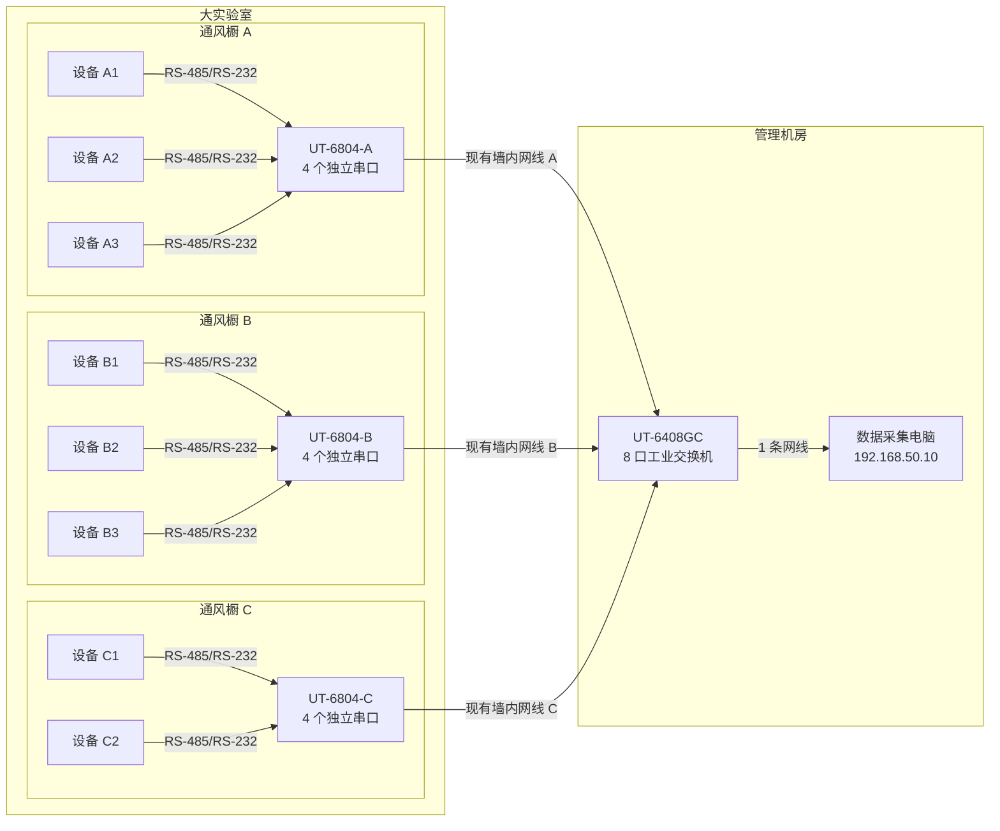

# 实验室三通风橱设备组网与采购方案（宇泰 UTEK）

> 版本：V1.0
> 日期：2026-07-24
> 适用范围：3 个通风橱、8 台现有串口设备、相邻管理机房 1 台采集电脑
> 采购范围：宇泰高科旗舰店
> 设计原则：一台仪器独占一个串口通道；现场只做串口到以太网转换，数据统一进入管理机房电脑。

## 1. 结论

推荐采用以下结构：

- 每个通风橱外侧安装 **1 台宇泰 UT-6804** 四口混合串口服务器，共 3 台。
- 管理机房安装 **1 台宇泰 UT-6408GC** 八口千兆非网管工业交换机。
- 每台实验设备独占 UT-6804 的一个串口通道；UT-6804 通过通风橱现有网口接入管理机房。
- 管理机房内，3 条通风橱网线和 1 条电脑网线都接到 UT-6408GC。
- 当前 8 台设备使用 8 个串口通道，3 台 UT-6804 一共提供 12 个通道，保留 4 个扩展位。

这套方案不占用电脑 USB 口，只占用电脑 1 个有线网口。若电脑的有线网口还要接办公网络，优先让电脑通过 Wi-Fi 接办公网络；仪器网络保持为独立有线网络。

## 2. 为什么选择 UT-6804，而不是普通交换机或 USB 转换器

实验设备输出的是 RS-485 或 RS-232，普通以太网交换机不能直接读取这两种串口信号。UT-6804 的作用是把每个设备的串口数据透明转换为 TCP/IP 网络数据。

选择 UT-6804 的理由：

1. 单机提供 4 个串口，每个口支持 RS-232、RS-485、RS-422，能够覆盖现有设备和暂未完全确认电气接口的粘度计。
2. 支持 TCP Server、TCP Client、虚拟串口 VCOM、Modbus TCP、MQTT 等模式。
3. 串口速率 300–921600 bps，可覆盖目前已知的 9600 bps 设备。
4. 12–48 VDC 宽压供电，适合实验室固定安装。
5. 一个通风橱只需要占用一条现有以太网链路。
6. 每台设备独占串口通道，符合当前应用“一台设备对应一个串口连接”的结构。

不要购买型号名称中带 `MT` 的版本作为本项目主设备。`UT-6804MT` 只有 RS-485/422，不支持 RS-232，无法兜底接入粘度计。

## 3. 网络拓扑



### 3.1 端口占用

管理机房交换机共 8 个网口，第一期只使用 4 个：

| UT-6408GC 网口 | 接入对象 | 用途 |
|---|---|---|
| 1 | 通风橱 A 对应墙口 | 接 UT-6804-A |
| 2 | 通风橱 B 对应墙口 | 接 UT-6804-B |
| 3 | 通风橱 C 对应墙口 | 接 UT-6804-C |
| 4 | 数据采集电脑 | 应用、数据库和设备采集 |
| 5–8 | 暂空 | 新通风橱、第二台服务器、维护电脑等 |

交换机是非网管型，不需要设置 IP、VLAN 或账号。

## 4. 采购清单

### 4.1 宇泰高科旗舰店设备

宇泰官网给出的京东官方商城入口为：[宇泰京东商城](https://uotek.jd.com/)。

京东商品页可能把多个型号和多个店铺聚合到同一页面。下单前必须同时核对：

1. 销售店铺显示为 **宇泰高科旗舰店**。
2. 选择的规格名称与下表完全一致。
3. 不接受店铺自动替换成相似型号。

| 序号 | 商品与规格 | 数量 | 用途 | 购买链接 |
|---|---|---:|---|---|
| 1 | **UT-6804，4 路 RS-232/485/422 三合一** | 3 台 | 每个通风橱 1 台 | [京东 UT-6804 商品页](https://item.jd.com/10106660124872.html) / [旗舰店入口](https://uotek.jd.com/) |
| 2 | **UT-6408GC，8 口千兆非网管工业交换机** | 1 台 | 管理机房汇聚 3 条通风橱链路和电脑 | [京东 UT-6408GC 商品页](https://item.jd.com/10056379349535.html) / [旗舰店入口](https://uotek.jd.com/) |
| 3 | UT-6804 配套 1 米 RJ45 转 DB9 公头串口线 | 共 9 条 | 8 台设备使用，另备 1 条；主机默认通常只附 1 条 | 通过[旗舰店](https://uotek.jd.com/)客服按 UT-6804 原厂引脚配购 |
| 4 | 与上述设备匹配的 24 VDC 电源 | 4 套 | 3 台 UT-6804 和 1 台 UT-6408GC | 通过[旗舰店](https://uotek.jd.com/)客服按设备型号配购 |
| 5 | 宇泰 DB9 免焊接线端子，公/母头按现场线缆确定 | 建议各 5 个 | 制作和维护 RS-485/RS-232 转接线 | [京东宇泰 DB9 接线端子](https://item.jd.com/10062467754442.html) |

### 4.2 下单备注模板

可把下面这段直接发给宇泰高科旗舰店客服：

> 本项目需要 3 台 UT-6804，必须是每个串口均支持 RS-232/RS-485/RS-422 的三合一版本，不要 UT-6804MT；另需 1 台 UT-6408GC。请为 3 台 UT-6804 和 1 台 UT-6408GC 分别配套可直接使用的 24VDC 电源。UT-6804 共需 9 条与官方 RJ45 串口引脚定义一致的 RJ45 转 DB9 公头线，请确认主机默认附送数量，并补齐到 9 条。

### 4.3 现场辅材

以下是布线辅材，不改变主设备选型：

| 辅材 | 建议数量 | 说明 |
|---|---:|---|
| Cat6 成品网线 | 9 条 | 通风橱侧 3 条、机房墙口侧 3 条、电脑 1 条、备用 2 条 |
| 两芯屏蔽双绞线 | 按设备位置测量 | RS-485 设备到 UT-6804，单段尽量不超过 3 m |
| 三芯屏蔽线 | 按设备位置测量 | RS-232 的 TX、RX、GND |
| DB15 公/母免焊接头 | 2 套 | TYD02 注射泵专用线及备用线 |
| 号码管和耐化学标签 | 1 批 | 每条线两端标注“柜号—服务器端口—设备号” |
| 小型电气保护箱或安装板 | 每柜 1 套 | UT-6804 安装在通风橱外侧、非腐蚀气流区域 |

网络线建议使用蓝色，串口线建议使用灰色或黑色，并在 UT-6804 的串口 RJ45 上加醒目的“串口，禁止接网络”标签。

## 5. 建议的设备和端口分配

以下分配以“现有 5 台 HMS-C、1 台 TYD02、1 台粘度计、1 台 WHD46-33”共 8 台设备为基础。若实际物理位置不同，只调整设备所在柜和端口，IP 规则保持不变。

| 通风橱 | 串口服务器 | 串口 1 | 串口 2 | 串口 3 | 串口 4 |
|---|---|---|---|---|---|
| A | UT-6804-A | HMS-C-01 | HMS-C-02 | TYD02-01 | 备用 |
| B | UT-6804-B | HMS-C-03 | HMS-C-04 | 粘度计-01 | 备用 |
| C | UT-6804-C | HMS-C-05 | WHD46-33-01 | 备用 | 备用 |

如果任一通风橱实际设备数超过 4 台，不要让两台设备临时并接到同一个端口。应把该柜的 UT-6804 改为 **UT-6808（8 路 RS-232/485/422 三合一）**，或在该柜增加第二台串口服务器和小型交换机。

## 6. IP 地址和 TCP 端口规划

仪器网络使用独立网段，不设置默认网关和 DNS：

| 设备 | 固定 IP | 子网掩码 |
|---|---|---|
| 管理机房电脑仪器网卡 | 192.168.50.10 | 255.255.255.0 |
| UT-6804-A | 192.168.50.21 | 255.255.255.0 |
| UT-6804-B | 192.168.50.22 | 255.255.255.0 |
| UT-6804-C | 192.168.50.23 | 255.255.255.0 |
| 以后新增串口服务器 | 从 192.168.50.24 起 | 255.255.255.0 |

每台 UT-6804 的四个串口使用一致的 TCP 端口规则：

| UT-6804 串口 | TCP Server 端口 |
|---|---:|
| 串口 1 | 4001 |
| 串口 2 | 4002 |
| 串口 3 | 4003 |
| 串口 4 | 4004 |

例如：

- 通风橱 A 的 HMS-C-01：`192.168.50.21:4001`
- 通风橱 B 的粘度计：`192.168.50.22:4003`
- 通风橱 C 的 WHD46-33：`192.168.50.23:4002`

串口服务器建议关闭 DHCP，全部使用固定 IP。固定 IP、柜号、设备端口和密码应同时记录在设备台账中。

## 7. UT-6804 串口侧引脚

UT-6804 的串口和以太网口都是 RJ45 外形，但电气定义完全不同。

### 7.1 串口 RJ45 定义

| RJ45 脚位 | RS-232 | RS-485 | RS-422 |
|---:|---|---|---|
| 1 | TxD | DATA+ | TxD+ |
| 2 | RxD | DATA- | TxD- |
| 3 | RTS | — | RxD+ |
| 4 | CTS | — | RxD- |
| 5 | DSR | — | — |
| 6 | GND | GND | GND |
| 7 | DTR | — | — |
| 8 | DCD | — | — |

### 7.2 最重要的防误插规则

- 只有 UT-6804 上标为 LAN/Ethernet 的 RJ45 口可以连接通风橱墙面网口。
- UT-6804 的 4 个串口 RJ45 只能连接实验设备。
- 不要把串口 RJ45 插入墙面网络口或交换机。
- 串口线和网络线必须使用不同颜色并在两端贴标签。

## 8. 各设备接口和接线

### 8.1 HMS-C 搅拌器，共 5 台

仓库资料：

- [HMS-C 说明书](../搅拌器/HMS-C说明书.docx)
- [HMS-C 设备通讯协议表](../搅拌器/设备通讯协议表.md)

已确认信息：

- 后面板具有独立 RS-485 接口。
- 协议寄存器包含显示温度、设定温度、显示转速、设定转速、加热状态和搅拌状态等。
- 当前资料没有给出 RS-485 物理插头的准确脚位，也没有给出确定的波特率、校验位和从机地址。

接线原则：

| UT-6804 | HMS-C |
|---|---|
| RJ45 串口脚 1，DATA+ | RS-485 A/+，以厂家确认或实测为准 |
| RJ45 串口脚 2，DATA- | RS-485 B/-，以厂家确认或实测为准 |
| RJ45 串口脚 6，GND | 若 HMS-C 提供信号地，则连接；没有则悬空 |

实施要求：

1. 每台 HMS-C 独占 UT-6804 的一个串口。
2. 首次接线前向 HMS-C 厂家索取 RS-485 插座脚位图，或使用厂家原装通讯线。
3. 使用只读探测脚本确认波特率、校验位和地址后再写入配置。
4. 在参数未确认前禁止向设备写寄存器，只允许读取状态。
5. 若无响应，先断电检查 A/B 是否反接，不要带电反复插拔。

### 8.2 TYD02 注射泵，共 1 台

仓库资料：

- [TYD02 注射泵说明书](../注射泵/TYD02注射泵说明书.md)
- [注射泵 RS485 通讯协议](../注射泵/注射泵RS485通讯协议标准.md)

已确认默认通信参数：

| 参数 | 设置 |
|---|---|
| 接口 | RS-485，Modbus RTU |
| 波特率 | 9600 |
| 数据位 | 8 |
| 校验位 | EVEN，偶校验 |
| 停止位 | 1 |
| 从机地址 | 1 |
| 面板传输模式 | 计算机 |

推荐使用泵的 DB15 外控接口制作专用线：

| TYD02 DB15 脚位 | 含义 | 接到 UT-6804 |
|---:|---|---|
| 3 | RS-485 A | 串口 RJ45 脚 1，DATA+ |
| 2 | RS-485 B | 串口 RJ45 脚 2，DATA- |
| 8 | COM | 串口 RJ45 脚 6，GND |

注意：

- DB15 的 4 脚是外部电压输入，10 脚是内部电源输出，**都不要接到 UT-6804**。
- 设备资料对内部电源输出电压存在 `+12V` 和 `+24V` 两种表述，因此本项目只使用 2、3、8 脚进行通信。
- 泵背部另有 6 针 RS-485 接口，其 3 脚为 B、4 脚为 A；现场只选择一种接口，不要同时并接。

### 8.3 方瑞旋转粘度计，共 1 台

仓库资料：

- [粘度计通信协议规范](../粘度计/协议规范.docx)
- [方瑞旋转粘度计操作手册](../粘度计/方瑞旋转粘度计操作手册.md)

已确认信息：

- 通信协议为自定义二进制上传帧，已知波特率为 9600。
- 上传数据包含粘度、温度、剪切速率、剪切应力、扭矩等。
- 通用手册显示后部有 USB、打印机接口和“主机连接孔”，但现有资料没有明确证明该孔一定是 RS-232，也没有给出插头脚位。

因此粘度计接线必须分两步：

1. 向方瑞确认当前实验室实际机型的“主机连接孔”电气标准、插头类型、Tx/Rx/GND 脚位，并优先使用原厂上位机线。
2. 确认是 RS-232 后，再接入 UT-6804 的独立串口。

若确认为标准 RS-232，基本接线关系为：

| UT-6804 | 粘度计 |
|---|---|
| RJ45 脚 1，TxD | 粘度计 RxD |
| RJ45 脚 2，RxD | 粘度计 TxD |
| RJ45 脚 6，GND | 粘度计 GND |

串口初始设置采用 `9600, 8N1`，但数据位、校验位和停止位仍需通过抓帧验证。不要仅凭“主机连接孔”名称自行焊接。

### 8.4 WHD46-33 温湿度监控器，共 1 台

仓库资料：

- [WHD46-33 模块说明](../温湿度监控器/README.md)
- [WHD46-33 协议解码](../lab_device_manager/instruments/whd46/protocol.py)
- [WHD46-33 通信探测](../lab_device_manager/instruments/whd46/discovery.py)

当前应用使用的参数：

| 参数 | 设置 |
|---|---|
| 接口 | RS-485，Modbus RTU |
| 波特率 | 9600 |
| 数据位 | 8 |
| 校验位 | NONE |
| 停止位 | 1 |
| 从机地址 | 1 |
| 数据 | 3 组温度/湿度通道，0.1 精度 |

代码中的现场提示记录 WHD46-33 使用 30/31 号端子作为 A/B。由于仓库中没有原厂接线图，安装人员必须以设备外壳丝印或原厂说明书确认 30、31 的正负极后再接线。

| UT-6804 | WHD46-33 |
|---|---|
| RJ45 脚 1，DATA+ | A/+ 端子 |
| RJ45 脚 2，DATA- | B/- 端子 |
| RJ45 脚 6，GND | 只有设备提供通信公共端时才连接 |

## 9. 每个 UT-6804 串口的建议配置

所有端口第一期均采用透明传输。不要在串口服务器内进行寄存器改写或数据格式转换。

| 设备 | 串口模式 | 波特率 | 格式 | 协议/地址 | 状态 |
|---|---|---:|---|---|---|
| HMS-C | RS-485 2 线 | 待探测 | 待探测 | Modbus RTU，地址待确认 | 安装前确认 |
| TYD02 | RS-485 2 线 | 9600 | 8E1 | Modbus RTU，地址 1 | 已知 |
| 粘度计 | 暂按 RS-232 | 9600 | 暂按 8N1 | 自定义二进制帧 | 电气接口待确认 |
| WHD46-33 | RS-485 2 线 | 9600 | 8N1 | Modbus RTU，地址 1 | 端子极性现场确认 |

网络侧建议：

- 模式：`TCP Server`
- 本地端口：按 4001–4004 规划
- 单连接优先：同一串口只允许采集程序连接，避免多个客户端抢占数据
- TCP 保活：开启
- 串口打包时间：先用设备默认值；若 Modbus 报文被拆分，再按宇泰说明书缩短打包间隔
- 配置完成后导出或截图保存每台服务器配置

## 10. 当前应用如何接入

### 10.1 Windows 管理机房电脑：第一期可直接使用 VCOM

UT-6804 支持 Windows 虚拟串口。使用宇泰 VCOM 工具把网络端口映射为 COM 口后，当前应用仍可按串口方式运行：

| 网络端点 | 示例虚拟串口 |
|---|---|
| 192.168.50.21:4001 | COM21 |
| 192.168.50.21:4002 | COM22 |
| 192.168.50.21:4003 | COM23 |
| 192.168.50.22:4001 | COM31 |
| 192.168.50.22:4002 | COM32 |
| 192.168.50.22:4003 | COM33 |
| 192.168.50.23:4001 | COM41 |
| 192.168.50.23:4002 | COM42 |

然后把应用 `config.toml` 中的 `serial_port` 改成相应 `COMxx`。

### 10.2 macOS/Linux 或长期生产：应增加原生 TCP Transport

当前采集引擎使用 `SerialTransport`，配置项也是 `serial_port`。宇泰 VCOM 工具主要面向 Windows，因此：

- 若管理机房电脑是 Windows，第一期可用 VCOM 快速上线。
- 若管理机房电脑是 macOS/Linux，应用必须增加 TCP socket 传输层。
- 长期生产也建议直接连接 `IP:端口`，减少对虚拟串口驱动的依赖。

建议后续配置格式：

```toml
[[devices]]
name      = "pump-1"
type      = "tyd02"
alias     = "注射泵"
transport = "tcp"
host      = "192.168.50.21"
port      = 4003
baudrate  = 9600
parity    = "EVEN"
modbus_addr = 1
```

当前 Engine 也不支持 5 台搅拌器共享一个串口后由软件轮询多个 Modbus 地址，所以第一期必须保持“一台设备一个 UT-6804 串口”。

## 11. 安装实施步骤

### 11.1 安装前

1. 给现有 8 台设备贴永久设备编号。
2. 记录每台设备所在通风橱、设备型号、序列号和通信接口照片。
3. 核对 3 组墙内网线的一一对应关系，并在两端标为 `H-A`、`H-B`、`H-C`。
4. 向 HMS-C 和方瑞厂商补齐缺失的接口脚位资料。
5. 下单时让宇泰客服书面确认型号、配套电源和串口线数量。

### 11.2 安装硬件

1. UT-6804 安装在通风橱外侧或邻近电气保护箱内，不能放在酸雾、溶剂蒸气或冷凝水直接经过的位置。
2. 每台实验设备使用独立串口线接到分配的 UT-6804 端口。
3. UT-6804 的 LAN 口接通风橱墙面网口。
4. 管理机房内 3 个对应墙口接 UT-6408GC 的 1–3 口。
5. 管理机房电脑接交换机第 4 口。
6. 设备和线缆两端均贴相同端口标签，例如 `A-P1-HMS01`。

### 11.3 配置网络

1. 一次只接入一台 UT-6804，使用宇泰搜索工具或设备说明书中的初始访问方式找到设备。
2. 修改管理员密码。
3. 设置固定 IP、子网掩码，网关和 DNS 留空。
4. 设置 4 个串口为 TCP Server，端口为 4001–4004。
5. 按设备表设置串口类型、波特率和校验位。
6. 配置完成后断电重启，确认参数仍保留。
7. 再接入下一台 UT-6804，避免初始 IP 冲突。

### 11.4 单台设备调试

调试顺序固定为：

1. 断电接线。
2. 上电后先 `ping` 串口服务器 IP。
3. 检查目标 TCP 端口能否连接。
4. 使用只读指令读取设备身份或状态。
5. 连续采集 10 分钟，确认没有 CRC 错误、重复帧或断线。
6. 保存串口参数、端口映射和一帧有效原始数据。
7. 调试通过后再接下一台设备。

Windows 网络测试示例：

```powershell
ping 192.168.50.21
Test-NetConnection 192.168.50.21 -Port 4001
```

macOS/Linux 网络测试示例：

```bash
ping -c 4 192.168.50.21
nc -vz 192.168.50.21 4001
```

## 12. 验收标准

### 12.1 硬件和网络

- [ ] 3 台 UT-6804 和 1 台 UT-6408GC 型号、序列号已入台账。
- [ ] 3 条墙内链路的通风橱端和机房端标签一致。
- [ ] 所有 UT-6804 均位于通风橱腐蚀气流之外。
- [ ] 串口 RJ45 与网络 RJ45 使用不同颜色和标签。
- [ ] 管理机房电脑能同时 ping 通 `.21`、`.22`、`.23`。
- [ ] 每个已占用 TCP 端口均可建立连接。

### 12.2 设备数据

- [ ] 5 台 HMS-C 分别有独立实时温度和转速数据。
- [ ] TYD02 能读取运行状态、流速和累计量，CRC 正确。
- [ ] 粘度计原始帧稳定，粘度、温度和扭矩解析与屏幕一致。
- [ ] WHD46-33 三组温湿度数据分别与设备显示一致。
- [ ] 连续运行 24 小时无持续断线，短暂断线后应用能恢复采集。
- [ ] 每台设备的时间戳与管理机房电脑时间一致。

### 12.3 应用

- [ ] 每台物理设备只映射到一个 COM 口或一个 TCP 端点。
- [ ] 应用重启后端口映射不变化。
- [ ] 实验开始、步骤打标和设备原始数据能落到同一时间轴。
- [ ] 设备离线时显示明确设备名、柜号和端口，不影响其他设备继续采集。

## 13. 注意事项

### 13.1 RS-485

- A/B、`+/-` 的命名在不同厂家间可能相反。推荐先按 `A/+ → DATA+`、`B/- → DATA-` 接线；无响应时断电后交换 A/B 再试。
- RS-485 使用屏蔽双绞线，A/B 必须使用同一对绞线。
- 屏蔽层只在控制柜或串口服务器一侧接地，避免两端接地产生环流。
- 设备到 UT-6804 的线很短时不要盲目添加 120 Ω 终端电阻；出现反射或长线时再按总线两端原则配置。
- 串口线与加热盘、电机和 220 V 电源线分开走线，平行距离尽量大于 20 cm；必须交叉时采用 90° 交叉。

### 13.2 RS-232

- RS-232 必须有公共地。
- TxD 必须接对方 RxD，RxD 必须接对方 TxD。
- 设备与 UT-6804 应放在同一通风橱附近，RS-232 线尽量小于 3 m。
- “直通线”和“交叉线”不能仅凭 DB9 公母头判断，必须根据设备脚位确认。

### 13.3 电源和实验室环境

- 所有接线、改线均应断电操作。
- 不从 TYD02 外控接口给 UT-6804 供电。
- UT-6804 和电源应安装在通风橱外侧的干燥区域。
- 24 VDC 电源和 220 VAC 接线由具备资质的电工完成。
- 不把办公网络的 DHCP 路由器直接接入仪器网段。
- 管理机房电脑应启用自动时间同步；实验数据时间戳以电脑为准。

### 13.4 网络安全

- 修改 UT-6804 默认管理密码。
- 仪器网段不要设置公网端口映射。
- 防火墙只允许管理机房电脑访问 `.21`–`.23` 的管理端口和 4001–4004。
- 不要让多个采集程序同时连接同一个串口服务器端口。
- 配置文件、设备台账和串口服务器配置截图应进入实验室受控文档。

## 14. 扩容规则

当前容量：

- 串口容量：12 个，已用 8 个，剩余 4 个。
- 机房交换机容量：8 个，已用 4 个，剩余 4 个。
- IP 地址：`.24` 以后可继续分配。

扩容按以下规则执行：

1. 同一通风橱新增 1 台设备且仍有空闲串口：直接接入本柜 UT-6804 空闲端口。
2. 同一通风橱超过 4 台设备：更换为 UT-6808 三合一版本，或增加一台串口服务器和本地交换机。
3. 新增第 4 个通风橱：新柜增加一台 UT-6804，机房端接 UT-6408GC 空闲口。
4. 全实验室超过 12 台设备：优先按设备所在柜扩容，不把跨柜 RS-485 线长距离串接。
5. 需要办公网远程访问时：由网络管理员增加受控路由或 VLAN，不直接把仪器交换机并入办公网。

## 15. 待现场确认清单

以下内容没有足够原厂资料，采购完成不等于可以直接接线：

| 项目 | 责任方 | 确认方式 |
|---|---|---|
| 3 个通风橱内的实际设备分布 | 实验室 | 现场盘点并更新端口表 |
| HMS-C RS-485 插座型号和脚位 | HMS-C 厂家/实验室 | 原厂图纸或原厂线连续性测试 |
| HMS-C 波特率、校验位、从机地址 | 实验室 | 只读探测 |
| 粘度计主机连接孔是否为 RS-232 | 方瑞厂家 | 当前实机型号对应的原厂说明 |
| 粘度计 Tx/Rx/GND 和帧格式 | 方瑞厂家/实验室 | 原厂线、抓帧、与屏幕值对照 |
| WHD46-33 30/31 端子极性 | 实验室 | 外壳丝印或原厂说明书 |
| 管理机房电脑操作系统 | 实验室 IT | Windows 使用 VCOM；macOS/Linux 开发 TCP Transport |
| 宇泰商品实际销售店铺和配件数量 | 采购 | 下单页及客服书面确认 |

## 16. 参考资料

### 16.1 宇泰官方资料

- [UT-6804 官方产品页](https://www.szutek.com/pro_view-699.html)
- [UT-6804 官方规格书 PDF](https://www.szutek.com/static/upload/file/download/65b3160d6b5b2.pdf)
- [UT-6408GC 官方产品页](https://www.szutek.com/pro_view-658.html)
- [宇泰官网给出的京东商城入口](https://uotek.jd.com/)

### 16.2 京东商品索引

- [京东宇泰高科产品索引](https://www.jd.com/jiage/6704b738942f63a7404.html)
- [京东 UT-6804 商品页](https://item.jd.com/10106660124872.html)
- [京东 UT-6408GC 商品页](https://item.jd.com/10056379349535.html)

> 京东 SKU、可售规格、附件和销售店铺可能变化。文档中的链接用于快速定位，最终订单以“宇泰高科旗舰店 + 精确型号/规格 + 客服书面确认”为准。
